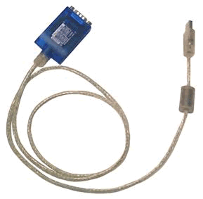

# Vehicle Network Interface Hardware: ValueCAN

The ValueCAN from Intrepid Control Systems is a network tool with 2 channels of Dual wire CAN. This device is fully isolated from the PC to avoid grounding or noise issues from affecting the PC.

Vehicle network configuration for ValueCAN can be done in neoVI 3G Explorer. Click [here](https://intrepidcs.com/products/vehicle-network-adapters/valuecan-4/) for more information from the ICS website.

