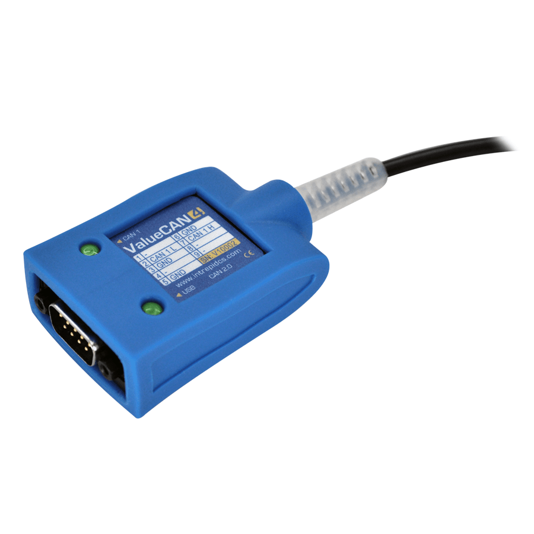

# Vehicle Network Interface Hardware: ValueCAN

#### **ValueCAN 4 Family Overview**

The ValueCAN 4 series is Intrepid’s next generation of low-cost, high-performance interfaces for CAN and CAN FD networks. A family of five related products, the ValueCAN 4 series offers CAN FD support, increased buffer size, improved latency performance, software-controlled CAN bus termination, enhanced LED indicators for CAN traffic, standalone operation over USB, a ruggedized metal case with protective rubber boot, and high-speed USB 2.0 support (480 Mbps) with Type A or Type C connectors.

Multiple channel and cable configuration options permit support for 1 to 4 CAN / CAN FD channels, as well as options that includes LIN and Ethernet/DoIP.

#### **ValueCAN 4-1 (1 CAN FD)**

The ValueCAN 4-1 FD is the next-generation, low-cost, high-performance tool for CAN FD, backward compatible with CAN 2.0. The ValueCAN 4-1 FD comes with all the field-tested features of the ValueCAN 3, plus much more, including increased buffer size, improved USB latency performance, and standalone operating capability using a USB charger.&#x20;

The ValueCAN 4-1 FD supports 1x CAN or CAN FD channels, has USB Type A and Type C options available, and certified drivers for Windows 7, 8, 8.1, 10, and 11.

The ValueCAN 4-1 FD is fully isolated from the PC, and its isolation layer is self-powered from USB, which eliminates the need for external power for the CAN transceiver. The ValueCAN 4-1’s isolation, a feature not common on low-cost interfaces, eliminates issues with grounding or noise affecting your PC and its communications. The ValueCAN 4-1 FD is also electrically hardened to survive an abusive environment, including reverse battery voltage and electrical transients. To make wiring easy, the device pinout is printed clearly on the housing. The ValueCAN 4-1 FD is also backed by a one-year warranty.

ValueCAN 4-1 FD can be used in a multitude of ways. Common uses include high speed flashing, ECU simulation, dealership CAN FD dongle, standalone mode for automating tests, and many more.&#x20;

User Guide for ValueCAN 4-1 - [https://cdn.intrepidcs.net/guides/ValueCAN4-1FD](https://cdn.intrepidcs.net/guides/ValueCAN4-1FD/)
