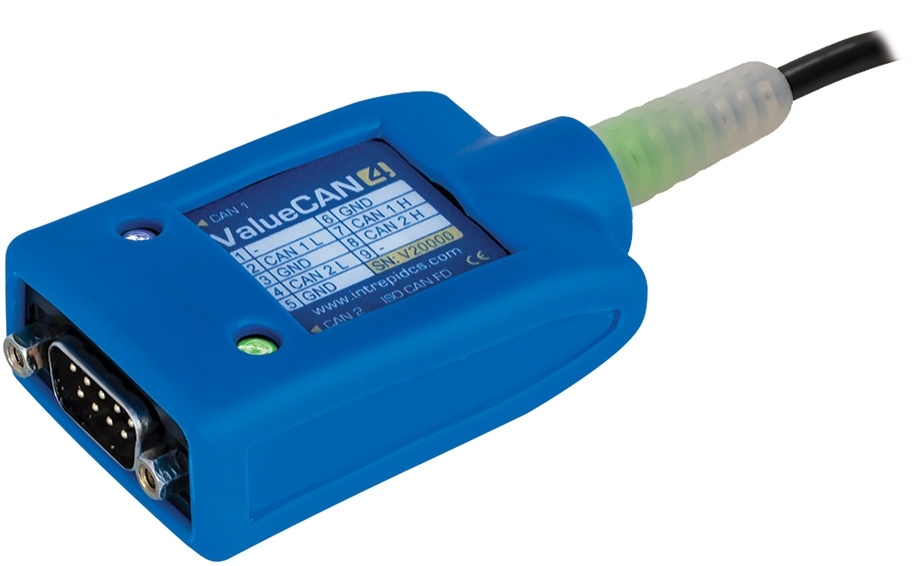

# Vehicle Network Interface Hardware: ValueCAN 4-2

#### &#x20;ValueCAN 4-2 **(2 CAN FD)**

The ValueCAN 4-2 is the next-generation, low-cost, high-performance tool for CAN FD, backward compatible with CAN 2.0. The ValueCAN 4-2 comes with all the field-tested features of the ValueCAN 3, plus much more, including software-controlled CAN termination, increased buffer size, improved USB latency performance, and standalone operating capability using a USB charger.

The ValueCAN 4-2 supports 2x CAN or CAN FD channels, has USB Type A and Type C options available, and certified drivers for Windows 7, 8, 8.1, and 10.

<figure><figcaption>
ValueCAN 4-2
</figcaption></figure>

User Guide for ValueCAN 4-2 - [https://cdn.intrepidcs.net/guides/ValueCAN4-2](https://cdn.intrepidcs.net/guides/ValueCAN4-2/)
