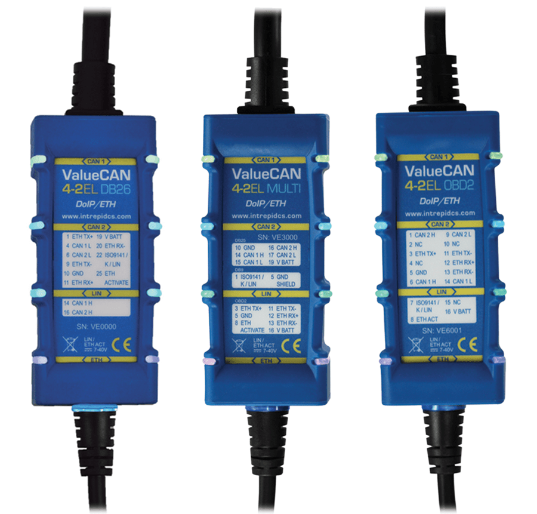

# Vehicle Network Interface Hardware: ValueCAN 4-2EL

#### **ValueCAN 4-2EL (2 CAN FD, 1 Ethernet, 1 LIN)**

The ValueCAN 4-2EL is part of the ValueCAN 4 series, a family of high-quality tools for CAN FD and CAN 2.0.

ValueCAN 4-2EL builds on the success of field-tested ValueCAN 3, with additional advancements like software-controlled CAN termination, lower USB latency, cybersecurity support, standalone operation via 5V USB power supply. The ValueCAN 4-2EL is fully isolated from the PC. The isolation feature, which is not common on low cost interfaces, resolves issues with grounding or noise affecting the PC. The ValueCAN 4-2EL is electrically hardened to survive abusive environments, including reverse battery and electrical transients.

ValueCAN 4-2EL has a strong aluminum case with rubber boot and surround LEDs indicating status of the device and its networks. The LED configuration can also be customized. ValueCAN 4-2EL’s integrated cable design makes it an easy to carry tool with no parts to misplace. The device pinout is printed on the housing to make wiring easy. ValueCAN 4-2EL is backed by a one-year warranty.

<figure><figcaption>
<strong>ValueCAN 4-2EL</strong>
</figcaption></figure>

User Guide for ValueCAN 4-2EL - [https://cdn.intrepidcs.net/guides/vcan4-4-2el](https://cdn.intrepidcs.net/guides/vcan4-4-2el/)
