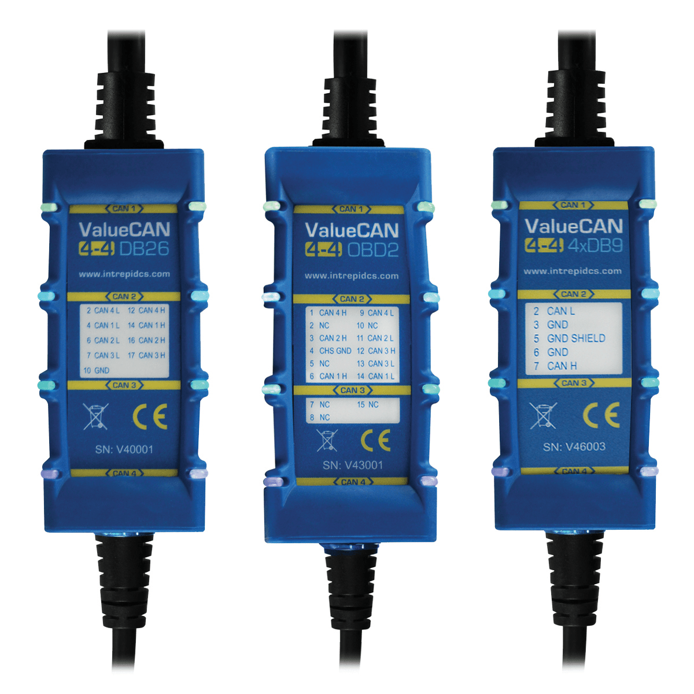

# Vehicle Network Interface Hardware: ValueCAN 4-4

#### **ValueCAN 4-4 (4 CAN FD)**

**Four Channels of CAN FD in One Cable!**

The ValueCAN 4-4 is part of the ValueCAN 4 series, a high-quality tool family for CAN FD and CAN 2.0. It builds on the field-tested ValueCAN 3, with the addition of software-controlled CAN termination, lower USB latency, cybersecurity support, standalone operation via 5V USB power supply.

The ValueCAN 4-4 is fully isolated from the PC. The isolation feature, which is not common on low cost interfaces, resolves issues with grounding or noise affecting the PC. The ValueCAN 4-4 is electrically hardened to survive abusive environments, including reverse battery and electrical transients.

The ValueCAN 4-4 has a strong aluminum case with a protective rubber boot. The USB and rugged cable end connectors are integrated in the device allowing users to carry just one cable for their project. (No more missing parts!)  The ValueCAN 4-4 has “Surround LEDs” indicating status of the device itself and its networks. The LED configuration can also be customized. The device pinout is printed on the housing to make wiring easy. ValueCAN 4-4 is backed by a one-year warranty.

<figure><figcaption>
ValueCAN 4-4
</figcaption></figure>

User Guide for ValueCAN 4-4 - [https://cdn.intrepidcs.net/guides/vcan4-4-2el](https://cdn.intrepidcs.net/guides/vcan4-4-2el/index.html)
