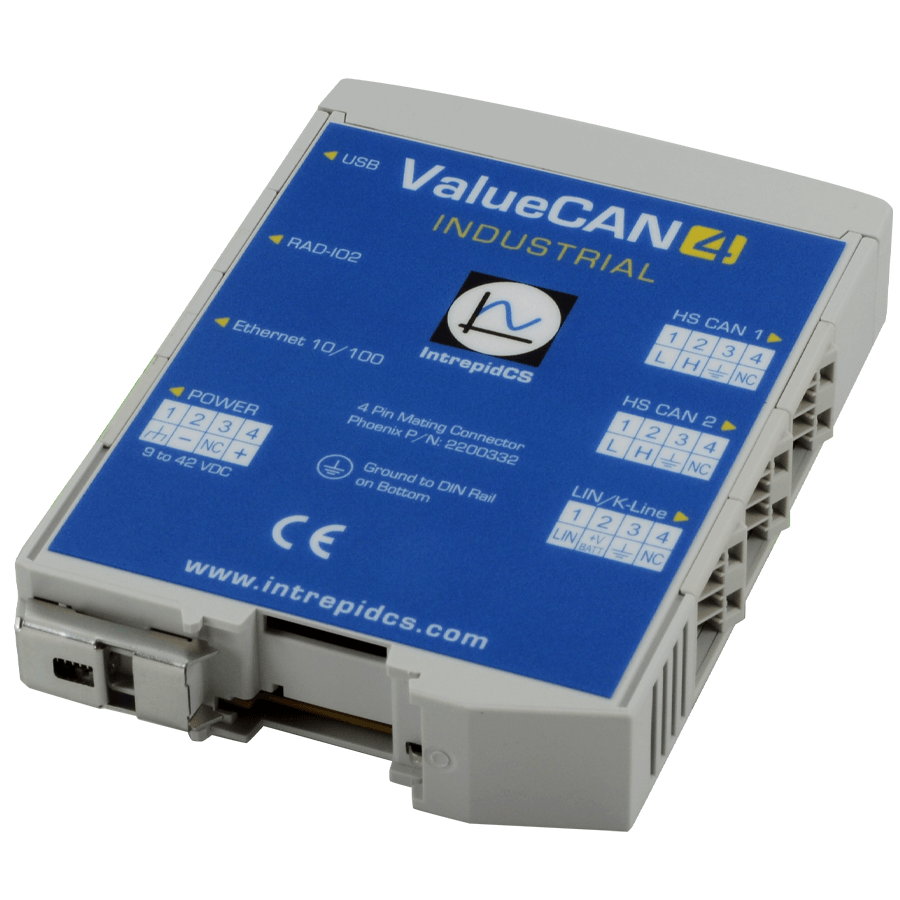

# Vehicle Network Interface Hardware: ValueCAN 4 Industrial

#### **ValueCAN 4 Industrial**

The ValueCAN 4 Industrial has been tested and verified to support independently galvanic isolated two high-bandwidth CAN FD networks, 1 LIN/KLine with USB and Ethernet Interface. In addition, DIN rails allow easy installation and an organized way to handle complicated wiring circuits.

<figure><figcaption>
ValueCAN 4 Industrial
</figcaption></figure>
