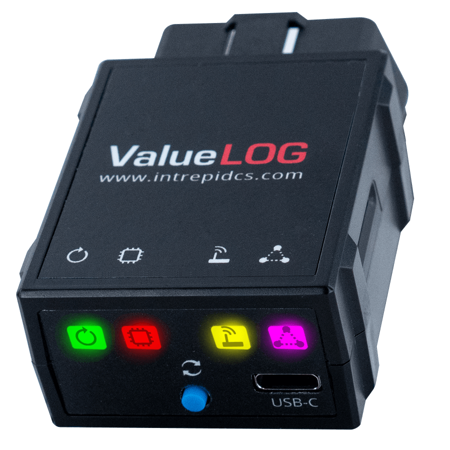

# Vehicle Network Interface Hardware: ValueLOG

The ValueLOG is the next-generation, low-cost, high-performance data logging device for CAN FD and LIN networks. The ValueLOG includes Ethernet (DoIP), four channels of CAN FD (Including SW CAN) and LIN in one tool. All channels run simultaneously and are time-stamped in hardware.

<figure><figcaption></figcaption></figure>

#### Applications

* Standalone data logger
* Standalone ECU or vehicle simulator
* In-vehicle data acquisition system
* Captive test fleet data collection
* Fleet management
* Vehicle interface with J2534 and RP1210

#### Features

* Up to 4x CAN FD
* Up to 1x SW CAN&#x20;
* Up to 1x LIN / K-Line&#x20;
* Up to 1x Ethernet (100BASE-TX for DoIP, switchable for 2x CAN FD network)
* 32GB eMMC storage&#x20;
* External GPS antenna support for collecting locations during data logging sessions&#x20;
* General purpose engineering tool for OBDII, enabling a wide array of applications such as data logging, simulation and gatewaying&#x20;
* Optional Unique configurable OBD II pinout through neoVI Universal Connector (NUC) architecture (optional)
* 9-axis Inertial Measurement Unit&#x20;
* RTC with battery

User Guide for ValueLOG - [https://cdn.intrepidcs.net/guides/ValueLOG](https://cdn.intrepidcs.net/guides/ValueLOG/index.html)&#x20;
