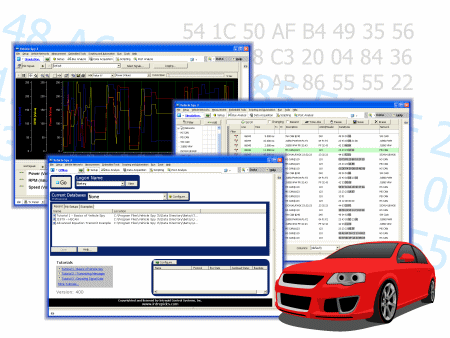

# Vehicle Spy Introduction

**Vehicle Spy** software for vehicle network electronics including the following communication protocols: CAN - J1850 - GMLAN - GM Class 2 - ISO9141 - Keyword 2000 - Ford - SCP - OBDII - J1587 - J1939 - Ford UBP - LIN and others.

**Introduction - Overview - Applications Tour - Users - Specifications - Required Hardware - Website**
