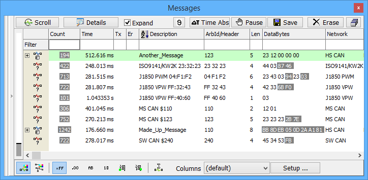

# Vehicle Spy Tour 1: Bus Monitor

A bus traffic monitor is used to view messages as they appear on your network. Vehicle Spy includes two ways of displaying these messages; a static list view and a scrolling list view. You can switch between these views with just the click of a button. Each message is time-stamped and counted.

Besides allowing a view of message traffic, Vehicle Spy offers many other useful bus monitoring features. One such feature is Filtering. Filtering for messages with specific bytes is very useful because it lets you quickly focus on just the messages that you are interested in. For example, if you wanted to see only the messages from the cluster, you could filter for specific messages with ID bytes from the cluster. To make creating filters easy, filter specifications can be entered directly from a message database.

Vehicle Spy further enhances message identification by displaying message text descriptions and decoding the signals contained in messages. Color coding is also available to make messages instantly recognizable.

In bus traffic monitor applications, message buffers are typically collected and then saved. To save time, Vehicle Spy allows for automation of analysis tasks. Vehicle Spy offers useful functions such as buffer statistics and post collection filtering. Message buffers are saved as CSV (Comma Separated Value) files. These files are completely compatible with Microsoft Excel, often the tool of choice for analysis.

**Introduction - Overview - Applications Tour - Users - Specifications - Required Hardware - Website**
