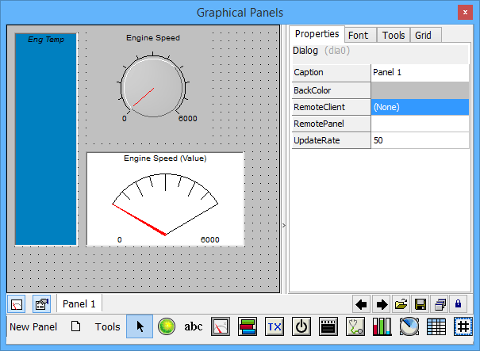

# Vehicle Spy Tour 2: Signal Monitoring and Recording

Signal monitoring and recording means collecting data such as RPM, Coolant Temperature, Engine Load, Throttle Position, MAP, etc. without performing any sensor wiring on a vehicle. This saves valuable time and money for people who collect automotive data.

In addition to collecting data from the vehicle network, Vehicle Spy is also capable of collecting sensor data along with vehicle network data. This feature is very helpful in many situations where comparing bus data to physical data is necessary.

[**Introduction**](../../) **-** [**Overview**](../) **-** [**Applications Tour**](vehicle-spy-tour-1-bus-monitor.md) **-** [**Users**](../../other-vehicle-spy-users.md) **-** [**Specifications**](../../vehicle-spy-specifications.md) **-** [**Required Hardware**](../../vehicle-spy-required-hardware-pc-system-requirements.md) **-** [**Website**](https://intrepidcs.com/products/software/vehicle-spy/vspy-float/)
