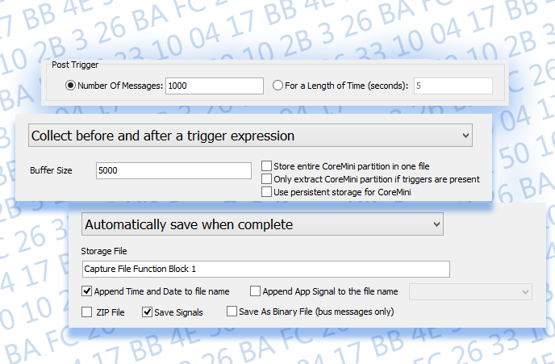

# Vehicle Spy Tour 3: Flight Recording

Flight recording is continuous monitoring of the network in a vehicle or on a vehicle bench for the purpose of observing or capturing issues over a period of time. Collection and the recording of network messages is very similar to the digital storage oscilloscopes where message buffers can be captured based on flexible triggering conditions. For example, collect 1000 messages before and after RPM goes above 5000.

Being able to collect a number of buffers simultaneously is useful when multiple issues are being monitored. Another useful application for flight recording is GPS (Global Positioning System), this allows coordination of data with the test track it was collected on.

[**Introduction**](../../) **-** [**Overview**](../) **-** [**Applications Tour**](vehicle-spy-tour-1-bus-monitor.md) **-** [**Users**](../../other-vehicle-spy-users.md) **-** [**Specifications**](../../vehicle-spy-specifications.md) **-** [**Required Hardware**](../../vehicle-spy-required-hardware-pc-system-requirements.md) **-** [**Website**](https://intrepidcs.com/products/software/vehicle-spy/vspy-float/)
