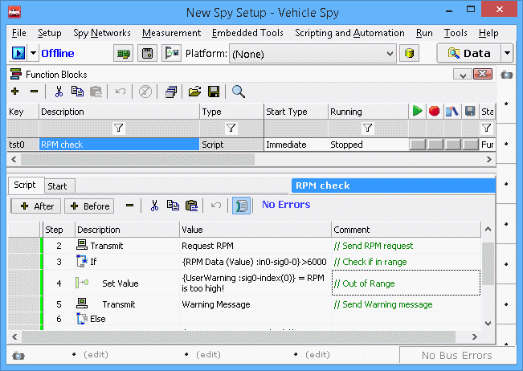

# Vehicle Spy Tour 5: Test Automation

Test automation refers to automatically testing electronic modules. Test automation involves being able to send messages, receive messages, capture buffers, and react to incoming data. Vehicle Spy has tools designed to simplify the automation creation process. One tool is called a Function Blocks. Function blocks allow for simple mouse driven scripting and data capture. Another Vehicle Spy automation tool is C Code Interface. C Code interface gives the ability to add C Code to access functions outside Vehicle Spy and bring that information and control into Vehicle Spy.

[**Introduction**](../../) **-** [**Overview**](../) **-** [**Applications Tour**](vehicle-spy-tour-1-bus-monitor.md) **-** [**Users**](../../other-vehicle-spy-users.md) **-** [**Specifications**](../../vehicle-spy-specifications.md) **-** [**Required Hardware**](../../vehicle-spy-required-hardware-pc-system-requirements.md) **-** [**Website**](https://intrepidcs.com/products/software/vehicle-spy/vspy-float/)****
