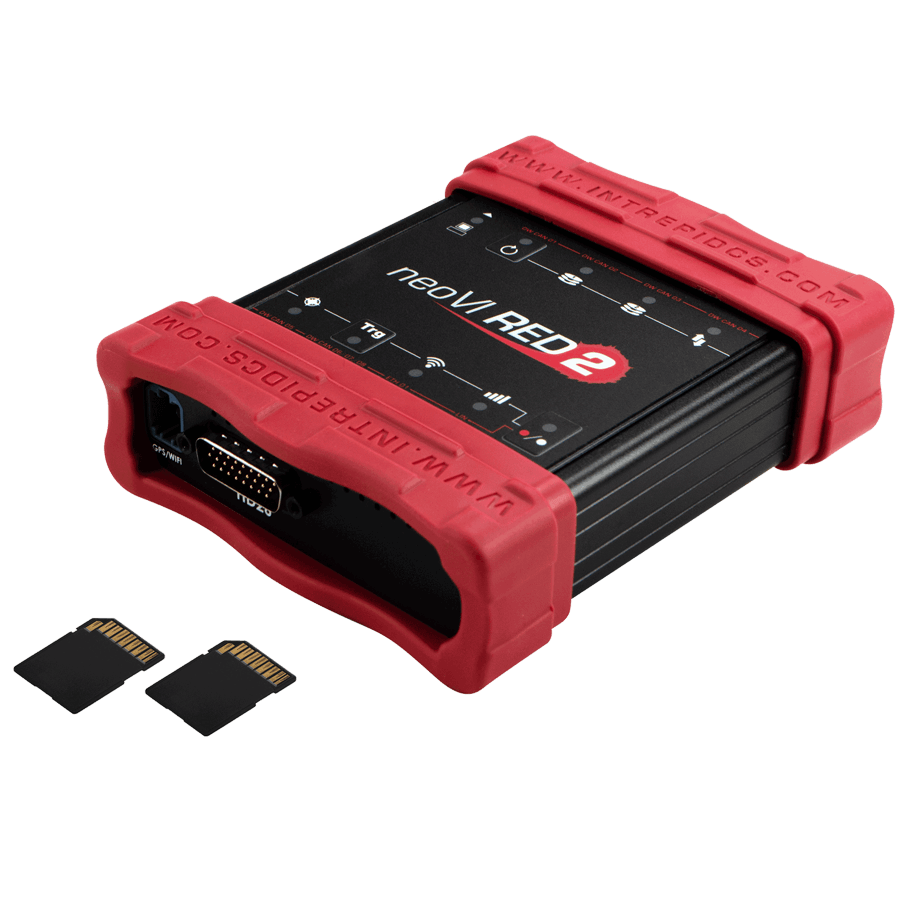
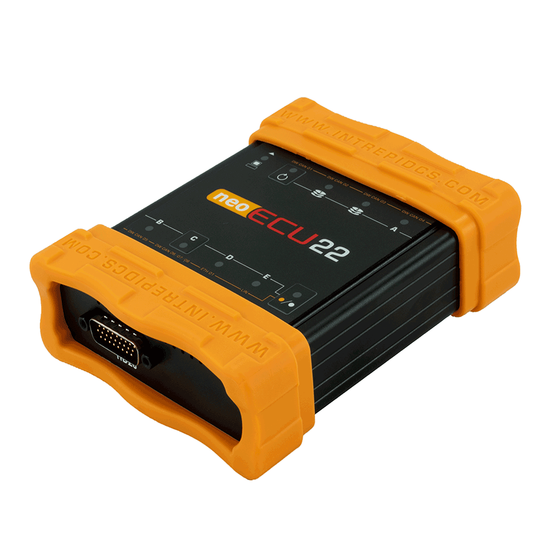

# Vehicle Spy Required Hardware PC System Requirements

### **PC System Requirements**

**Minimum Requirements**

* 32-bit or 64-bit Windows Vista\* / 7 / 8.X\*\* / 10 / 11)
* At least 4 GB system RAM
* Intel or AMD 1.8 Ghz (or better)
* XGA (1366x768) screen resolution or better
* Current neoVI, ValueCAN, or RAD Devices. i.e neoVI vehicle network adapters (FIRE 2, ION, RED2, FIRE3, etc), ValueCAN devices (ValueCAN 4 family), or supported Automotive Ethernet hardware (such as the RAD-Galaxy, RAD-Star 2, or Ethernet EVB, etc).

**ICS Recommended**

* Windows 10 64-bit
* 8 GB or more system RAM
* Intel or AMD 2.2 GHz 4 Core or better processor
* 1080p (1920x1080) or higher screen resolution
* neoVI vehicle network adapters (FIRE 2, ION, RED2, FIRE3, etc), ValueCAN devices (ValueCAN 4 family), or supported Automotive Ethernet hardware (such as the RAD-Galaxy, RAD-Star 2 or Ethernet EVB etc).

**Optional PC System Requirement**

* Audio Card
* GPS (Global Positioning System) Unit with NMEA RS232 Interface
* PC Joystick

\* Some Ethernet features are not supported with this version of Windows, but the software is otherwise compatible\
\*\* Windows RT is not supported by Vehicle Spy

**Vehicle Network Interface Hardware**

Vehicle Spy supports a number of hardware interfaces for vehicle networks designed and manufactured by Intrepid Control Systems, Inc. Each has a high level of integration with Vehicle Spy.

|  | 
<strong>neoVI FIRE 3 Vehicle Interface</strong>  Recommended for: <strong>CAN, GMLAN, ISO9141, Keyword 2000, OBD-II, LIN, and J1939</strong>  More information here: <a href="https://intrepidcs.com/products/vehicle-network-adapters/neovi-fire-3-canfd-lin-ethernet-vehicle-interface-wireless-datalogger/"><strong>neoVI FIRE3</strong></a>
          |
| -------------------------------------------------------------------------------------------------------------------------------------------------------------------- | --------------------------------------------------------------------------------------------------------------------------------------------------------------------------------------------------------------------------------------------------------------------------------------------------------------------------------------------------------------------------- |
|                                                                                                                                                                      |                                                                                                                                                                                                                                                                                                                                                                             |
|                    | 
<strong>neoVI Fire 2</strong>  Recommended for: <strong>CAN, GMLAN, ISO9141, Keyword 2000, OBD-II, LIN, J1939 and More</strong>  More information here: <a href="https://intrepidcs.com/products/vehicle-network-adapters/neovi-fire-2/"><strong>neoVI Fire 2</strong></a>
                                                                               |
|                                                                                                                                                                      |                                                                                                                                                                                                                                                                                                                                                                             |
|                                                                                                               | 
<strong>RAD Galaxy Vehicle Interface</strong>  Recommended for: <strong>CAN, J1850, GMLAN, GM Class 2, ISO9141, Keyword 2000, Ford SCP, OBD-II, J1587, J1708, LIN, and J1939</strong>  More information here: <a href="https://intrepidcs.com/products/automotive-ethernet-tools/rad-galaxy-active-network-tap-gateway/"><strong>RAD Galaxy</strong></a>
 |
|                                                                                                                                                                      |                                                                                                                                                                                                                                                                                                                                                                             |
|                                                                                                                                      | 
<strong>neoVI RED 2 Vehicle Interface</strong>  Recommended for: <strong>DW CAN, ISO9141, Keyword 2000, LIN, and J1939</strong>  More information here: <a href="https://intrepidcs.com/products/vehicle-network-adapters/neovi-red-2/"><strong>neoVI RED</strong></a>
                                                                                   |
|                                                                                                                                                                      |                                                                                                                                                                                                                                                                                                                                                                             |
|                                      | 
<strong>ValueCAN4 Vehicle Interface</strong>  Recommended for: <strong>DW CAN, and J1939</strong>

More information here: <a href="http://store.intrepidcs.com/ValueCAN3-DW-2-Channel-p/vcan-dw3.htm">ValueCAN</a>
                                                                                                                                        |
|                                                                                                                                                                      |                                                                                                                                                                                                                                                                                                                                                                             |
|                              | 
<strong>neoECU22 Vehicle Interface</strong>  Recommended for: <strong>CAN, GMLAN, ISO9141, Keyword 2000, OBD-II, LIN, J1939, MOST, Flexray, and more</strong>.  More information here: <a href="https://intrepidcs.com/products/ecu-simulators/neoecu-22-gateways-and-ecu-simulations/"><strong>neoECU22</strong></a>
                                    |
|                                                                                                                                                                      |                                                                                                                                                                                                                                                                                                                                                                             |
|                     | 
<strong>neoVI ION Vehicle Interface</strong>  Recommended for:<strong>CAN, GMLAN, ISO9141, Keyword 2000, OBD-II, LIN, J1939, MOST, Flexray, and more</strong>.  More information here: <a href="https://www.intrepidcs.com/products/vehicle-network-adapters/neovi-ion/">neoVI ION</a>
                                                                   |
