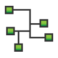
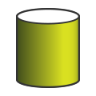

# Vehicle Spy Specifications

| 

Vehicle Spy Application
 | <ul><li>Vehicle Spy allows simultaneous monitoring and transmission on multiple vehicle networks. These networks can have different vehicle network protocols.</li><li>Custom tabs allow for quick maneuvering between screens</li><li>Save and recall Vehicle Spy setup files</li><li>Vehicle Spy Logon manages multiple users, keeps track of your last 100 setup files, and manages the data directories</li><li>C Code Interface for coding more complicated functions</li><li>Access to GPS (Global Positioning System)</li><li>Message discovery function with message monitor allows a user to reverse engineer message strategies</li><li>Online help with step-by-step tutorials</li></ul>                                                                                                                                                                                                                                                                                                                                                                                                                                                                                                                                                                                                                                                                                         |
| :-----------------------------------------------------------------------------------------------------------------: | ------------------------------------------------------------------------------------------------------------------------------------------------------------------------------------------------------------------------------------------------------------------------------------------------------------------------------------------------------------------------------------------------------------------------------------------------------------------------------------------------------------------------------------------------------------------------------------------------------------------------------------------------------------------------------------------------------------------------------------------------------------------------------------------------------------------------------------------------------------------------------------------------------------------------------------------------------------------------------------------------------------------------------------------------------------------------------------------------------------------------------------------------------------------------------------------------------------------------------------------------------------------------------------------------------------------------------------------------------------------------------------------- |
|          

Messages View
         | <ul><li>Displays message text descriptions</li><li>Displays all signals contained in a message such as RPM, Pedal Position, Vehicle Speed, etc.</li><li>Include and exclude filters based on Network, Node, Message, and Data Type</li><li>Displays all networks in the same monitor</li><li>Pause and review history</li><li>Absolute and relative time display</li><li>Storage and Review of Data Files in an Excel compatible format which includes message descriptions and signals</li><li>Post acquisition filtering and analysis</li><li>Hexadecimal, Decimal, Binary and ASCII data displays</li><li>Color Filters based on Message, Network, or Node</li><li>Buffer History is limited only by system memory - allows history lengths of greater than a million messages</li><li>Custom fonts and colors</li><li>Bus load display</li><li>Display formats include hex, decimal, ASCII, and binary</li><li>Activity Coloring: Messages and Signals that are not present are grayed out. Messages and Signals that are received toggle from black to dark red every time they are received.</li><li>Data byte change highlighting. Every time a message byte changes it is highlighted blue. This allows detection of message changing status.</li><li>Sort the monitor based on any message part</li><li>Copy Messages to Message Editor quickly through right-click menu</li></ul> |
|      

Message Editor
      | <ul><li>Received Messages and Transmit Messages organized into separate tables</li><li>Online interactive editing (you don't have to stop Vehicle Spy or go "offline"!)</li><li>Specify Message with byte, nibble or bit resolution for entire message</li><li>Select Database button to quickly load a message or signal from the database</li><li>Calculate a binary, state encoded, text, and analog signal from a message with an arbitrary equation.</li><li>Custom binary and analog formats including binary, hex, engineering, and scientific notation.</li><li>Link to a Transmit Message on any network allows auto response or transmit on change functionality</li><li>Calculated signal type allows a sinusoidal, ramping and custom equation signal generation</li><li>Expected Length input verifies a message's length</li><li>Specify based on message properties such as errors or bus events</li><li>Selectable color specification per message</li><li>Cut, copy, paste and sort messages and signals</li></ul>                                                                                                                                                                                                                                                                                                                                                         |
|          

Transmit Panel
         | <ul><li>Transmit Messages defined in Message Editor View are automatically listed in the Transmit Panel</li><li>Transmitted Message data can be calculated from messages and signals, received or otherwise</li><li>Periodic message transmission</li><li>Manual transmit button included as part of the pane,</li></ul>                                                                                                                                                                                                                                                                                                                                                                                                                                                                                                                                                                                                                                                                                                                                                                                                                                                                                                                                                                                                                                                                    |
|    

Graphical Panels
    | <ul><li>Build your own custom application with panels that have controls and indicators</li><li>Controls and indicators include the following: Chart, Transmit Button, Function Block Button, On/Off Button, Knob, Meter, LED/Light, Text Display, Text Entry, Numeric Entry, Graphical Display, Dropdown List, Barograph, Grid, Action Button, and Scrolling Monitor</li><li>Charts X vs Y and Y vs T</li><li>Dropdown control for State Encoded parameters such as PRNDL or Power Mode</li><li>Action Button allows printing of panel, switching panels, and access to the user's data directory</li><li>Graphical display allows colored lines and custom graphics, such as logos, on the panel</li><li>Each user interface item has many properties allowing customization</li><li>Visual Studio style property editor</li></ul>                                                                                                                                                                                                                                                                                                                                                                                                                                                                                                                                                        |
|                       
 Networks
                       | <ul><li>Supports any number of networks</li><li>Selectable color specification per network</li><li>Network Stats for CAN and J1850 networks including: message count, message rate, message rate max, bus utilization, and bus utilization max.</li></ul>                                                                                                                                                                                                                                                                                                                                                                                                                                                                                                                                                                                                                                                                                                                                                                                                                                                                                                                                                                                                                                                                                                                                   |
|                           
 Nodes
                           | <ul><li>Supports any number of Nodes</li><li>Nodes can come from different networks</li><li>Selectable color specification per node</li><li>Nodes Stats for CAN and J1850 networks including: message count, message rate, message rate max, bus utilization, and bus utilization max.</li></ul>                                                                                                                                                                                                                                                                                                                                                                                                                                                                                                                                                                                                                                                                                                                                                                                                                                                                                                                                                                                                                                                                                            |
|    

Function Blocks
    | <ul><li>Replay of captured network traffic back with optional filter</li><li>Custom script which has script commands: Jump to step, Transmit Message, Wait a specific amount of time, wait for a specific equation to be true, (trigger, start, stop, save) another function block, set an incoming message to value or equation, reset a messages stats, stop script, show a graphical panel, jump to a step if an equation is true, and more.</li><li>Capture a network buffer with pre-post triggering based on an arbitrary equation</li><li>Automatically save network traffic with unique file naming</li><li>Actuate a digital output based on an event</li><li>Transmit a group of messages with a programmable inter-message delay and offset</li><li>Start, stop, and trigger the Function Block based on equations or other function blocks</li><li>Create as many function blocks as you require</li></ul>                                                                                                                                                                                                                                                                                                                                                                                                                                                                      |
|           

Databases
           | <ul><li>Load external database that can define the messages received and transmitted on the vehicle network</li><li>Databases allow automatic description and display of messages and signals</li><li>Allows quick entry into the Message Editor</li><li>DBC and UEF file formats for import and export support</li><li>Each network can have a separate database</li></ul>                                                                                                                                                                                                                                                                                                                                                                                                                                                                                                                                                                                                                                                                                                                                                                                                                                                                                                                                                                                                                 |
|         

Diagnostics
         | <ul><li>Builds and Launches diagnostic requests</li><li>Uses database to decode diagnostic responses</li><li>Data returned in easy to understand text and raw message format</li></ul>                                                                                                                                                                                                                                                                                                                                                                                                                                                                                                                                                                                                                                                                                                                                                                                                                                                                                                                                                                                                                                                                                                                                                                                                      |
|    

VehicleScape DAQ
    | <ul><li>Collects and logs different types of message data: Normal Messages, GMLAN, ISO14229, CCP, XCP, or custom defined signals</li><li>Configure PC logging to store collected information to the PC</li><li>Build a standalone logging script through a few simple setup dialogs</li><li>Set up multiple collections with different trigger conditions</li><li>Gateway signal data to new frames for other devices</li><li>Configure standalone setups for Wireless neoVI</li></ul>                                                                                                                                                                                                                                                                                                                                                                                                                                                                                                                                                                                                                                                                                                                                                                                                                                                                                                      |

***

**Introduction - Overview - Applications Tour - Users - Specifications - Required Hardware - Website**
