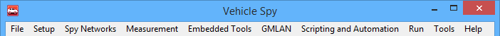

# Vehicle Spy Main Menus

The different features of Vehicle Spy are accessed through the main menus shown in **Figure 1**.

Each menu item holds a different group of tasks that can be done with the software. Click on the menu names in **Table 1** to see further details for each of them.

**Table 1: Vehicle Spy Main Menus**

| Main Menu                | Description                                                                                                               |
| ------------------------ | ------------------------------------------------------------------------------------------------------------------------- |
| File                     | Contains tasks for opening and saving files.                                                                              |
| Setup                    | This menu item has hardware and database configuration tools.                                                             |
| Spy Networks             | Common Vehicle Spy tasks are found in this menu.                                                                          |
| Measurement              | Tools for looking at and recording signal values are found here.                                                          |
| Embedded Tools           | Holds other tools to help with development.                                                                               |
| GMLAN                    | Helpful tools for GMLAN users. Note: GMLAN must be enabled on the Tools> Options, Spy Networks tab to see this selection. |
| Scripting and Automation | Tools to automate Vehicle Spy tasks.                                                                                      |
| Run                      | Another way to start and stop Vehicle Spy.                                                                                |
| Tools                    | Contains setup options, utilities, and hardware specific tools.                                                           |
| Help                     | Provides access to help documents, website, and version information.                                                      |
