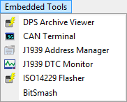

# Main Menu: Embedded Tools

The Vehicle Spy Embedded Tools main menu contains various tools for development as shown in Figure 1. Refer to Table 1 for a brief description of each selection.

**Table 1: Vehicle Spy Embedded Tools Menu**

| Embedded Tools Menu Selection                     | Description                                                                                                                                                                                                                     |
| ------------------------------------------------- | ------------------------------------------------------------------------------------------------------------------------------------------------------------------------------------------------------------------------------- |
| [DPS Archive Viewer](dps-archive-viewer.md)       | Opens a viewer for looking inside GM DPS archives. Note: GMLAN must be enabled on the Tools -> Options, Spy Networks tab to see this selection.                                                                                 |
| [CAN Terminal](can-terminal.md)                   | Opens CAN Terminal for ECU debugging.                                                                                                                                                                                           |
| [J1939 Address Manager](j1939-address-manager.md) | Opens an address manager for the J1939 network. Note: J1939 must be enabled on the Tools -> Options, Spy Networks tab to see this selection.                                                                                    |
| [J1939 DTC Monitor](j1939-dtc-monitor.md)         | Opens a diagnostic trouble code monitor for the J1939 network. Note: J1939 must be enabled on the Tools -> Options, Spy Networks tab to see this selection.                                                                     |
| ISO14229 Flasher                                  | Opens a flash tool for Ford ISO14229 ECUs. Note: GGDS must be enabled on the Tools -> Options, Spy Networks tab to see this selection.                                                                                          |
| [BitSmash](bitsmash.md)                           | Opens BitSmash tool to "smash" or corrupt a specified CAN frame. Requires ValueCAN 3, <mark style="color:red;">neoVI</mark> <mark style="color:red;">**FIRE**</mark><mark style="color:red;">, or neoVI PLASMA hardware</mark>. |
