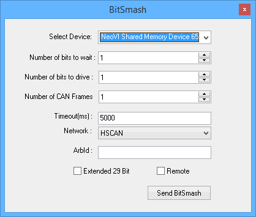

# BitSmash

The [Embedded Tools](./) -> BitSmash is a hardware mode that can "smash" or corrupt received CAN frames. This feature can be useful for testing how an ECU or network reacts to specific bad CAN frames due to precise control down to the bit level.\
\
In general, hardware is setup with BitSmash to wait for a period of time for a certain CAN frame and then smash bits in that frame after it is received.\
\
More specifically, BitSmash requires [ValueCAN 3](../../vehicle-network-interface-hardware/vehicle-network-interface-hardware-valuecan/), [neoVI **FIRE**](../../vehicle-network-interface-hardware/vehicle-network-interface-hardware-neovi-fire/), or neoVI PLASMA hardware. The CAN controller of the hardware is disabled while in BitSmash mode. As a result, the hardware can only smash received frames; it can not smash one of its own transmit frames. This also means either a second device or a special CAN bridging cable is needed if you want to monitor the CAN bus during the smash event.\
\
Setting up BitSmash requires going online with hardware that supports it then using the dialog shown in Figure 1.

**Select Device**\
Selects a connected device to run in BitSmash mode.\
\
**Number of bits to wait** (1-157)\
Selects the first bit to "smash" starting after the ArbID of the RAW CAN frame.\
\
**Number of bits to drive** (1-157)\
Selects the total number of bits to "smash".\
\
**Number of CAN frames** (1-254)\
Sets the total number of CAN frames to "smash".\
\
**Timeout (ms)**\
Number of milliseconds to wait to receive the specified CAN frame. Normal hardware operation resumes after this timeout expires.\
\
**ArbId**\
The arbitration identifier of the CAN frame to "smash".\
\
**Network**\
Selects the CAN network on the hardware that will get the BitSmash.\
\
**Extended 29 bit**\
Sets the ArbID as 29 bit when checked or 11 bit if unchecked.\
\
**Remote**\
When checked, remote frames are targeted.\
\
**Send BitSmash button**\
This button does NOT transmit a smashed CAN frame! Clicking this button just sends the BitSmash setup up to the selected device. The device will stay in BitSmash mode until the correct CAN ArbID is received and smashed or until the timeout expires.
