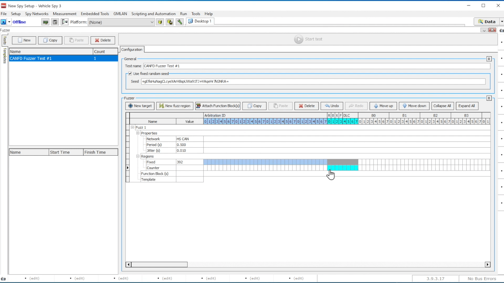

# CAN and CAN FD Fuzzing

This documentation provides a comprehensive guide on utilizing CAN or CAN FD Fuzzing within Vehicle Spy Enterprise Plus. Fuzzing is a technique employed to detect potential vulnerabilities by inundating the bus with a substantial amount of random or pseudo-random data.

<figure><figcaption>
Fuzzing - Messages window
</figcaption></figure>

#### Accessing Fuzzing View:

To engage in Fuzzing activities within the Vehicle Spy Enterprise Plus software, users need to navigate to the Fuzzing View. This can be accessed through the menu bar by selecting "Embedded Tools" and then choosing "Fuzzer" from the dropdown menu. This feature serves as the entry point for users to initiate Fuzzing tasks.

<figure><figcaption>
How to start with Fuzzer 
</figcaption></figure>

#### Creating Tests:

Fuzzing involves the creation of various test scenarios to assess system vulnerabilities. In the Fuzzer View, users can generate multiple tests by clicking the "New" button located in the top left corner. Each test can be named for easy identification and reference. Additionally, users can set a Pseudo Random Seed to ensure consistency in random data generation across multiple test runs. If no seed is provided, Vehicle Spy will generate a pseudo-random seed automatically.

**Below is the step-by-step process -**&#x20;

1\) Generate a target for the fuzzer by clicking the New Target button and selecting either a Blank Target or a template from the database**.**

<figure><figcaption></figcaption></figure>

2\) After Clicking on New Target or Blank Target you will able to Target Configure option.&#x20;

<figure><figcaption>
You can add New or Template from database
</figcaption></figure>

#### Target Configuration

Configuring the target is essential for simulating real-world scenarios accurately. Within the Target View, users can specify the target's name, the networks it is associated with, and its periodicity. These parameters define how often the target sends messages, providing crucial context for Fuzzing activities. In the Target view, configure: Target’s Name, Modify Target’s Networks, Configure Target’s Periodicity. For Example: Set a 500 millisecond update rate for the transmitted message and add 10 milliseconds of pseudo-random jitter.

1\) In the next steps you will be able to Modify Target’s Networks, Configure Target’s Periodicity window.

<figure><figcaption>
Target Configuration
</figcaption></figure>

#### Defining Fuzz Regions:

Fuzz Regions delineate specific areas within messages where Fuzzing occurs. Users can select from three types of Fuzz Regions: Random, Counter, or Fixed value. This feature enables precise control over the injected data types during Fuzzing tests, catering to diverse testing requirements.

1\) For defining Fuzz Regions you need to click on New fuzz region button.

<figure><figcaption>
Defining Fuzz Regions
</figcaption></figure>

2\) Example of defining Values in Fuzz Regions

<figure><figcaption>
Deefining Values in Fuzz Regions
</figcaption></figure>

3\) Adding another value

<figure><figcaption>
Adding Counter Values
</figcaption></figure>

#### Activating and Monitoring Tests:

Once tests are configured, users can activate them by clicking the "Start Test" button. During test execution, users can monitor messages in real time using the Messages View. This feature provides immediate feedback on the impact of Fuzzing activities, aiding in the assessment of system vulnerabilities.

1\) After Adding/Defining Values in the Fuzz region you will be ready to activate and monitor your tests. You need to click on Start test button.

<figure><figcaption>
Ready to start your tests
</figcaption></figure>

2\) If you need to stop the tests you can stop the tests also.

<figure><figcaption>
Stop Tests
</figcaption></figure>

#### Viewing Test Information and Results:

Test information and results are presented in a structured manner within the software interface. Users can access details such as test start and stop times, as well as the data generated and received during tests. This feature facilitates comprehensive analysis of Fuzzing test outcomes, aiding in the identification of potential vulnerabilities.

1\) Following is the Test information and results

<figure><figcaption>
Viewing Test Information and Results with template
</figcaption></figure>

2\)&#x20;

<figure><figcaption></figcaption></figure>

#### Creating Templates:

Templates streamline the process of creating and configuring Fuzzing tests. Using an intuitive interface, users can design custom templates that are saved in JSON format. These templates serve as reusable resources for future tests, promoting efficiency and consistency in testing procedures.

1\) To create a template, click on **New Configuration** and follow these steps:

<figure><figcaption></figcaption></figure>

2\) Continue to the next phase of the process, ensuring all preliminary requirements have been met.

<figure><figcaption></figcaption></figure>

3\) Ensure that you follow all guidelines provided in the previous steps. This will ensure that the process is completed smoothly and accurately. Double-check your work for any errors before proceeding further.

<figure><figcaption></figcaption></figure>

4\) In this step, continue to follow the instructions carefully to complete the process.

<figure><figcaption></figcaption></figure>

