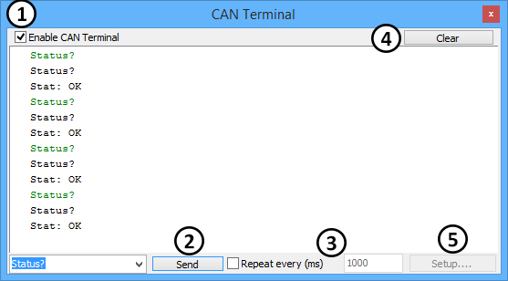
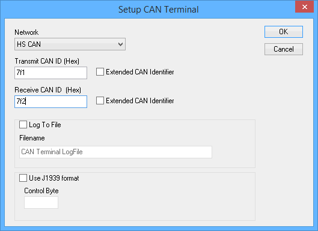

# CAN Terminal

The [Embedded Tools](./) -> CAN Terminal is a7f1 feature that can be useful for developing and debugging ECUs. CAN Terminal lets you send text commands and receive responses from an ECU. All commands and responses are shown in the main window of the CAN Terminal.

The first requirement for using the CAN Terminal is that a connected ECU supports this type of communication protocol. The protocol requires the strings to be sent using ASCII and to have a $0D as the last byte in the string. The message can be in more than one frame, but must have a $0D to end the string.\
\
Can Terminal is enabled by checking the **Enable CAN Terminal** check box in the upper left of the dialog (Figure1: ). The command or string to send to the ECU goes in the textbox next to the **Send** button (Figure1: ). If the message is periodic, check **Repeat Every (ms)** and enter in the rate to have it repeat (Figure1: ). The **Clear** button (Figure1: ) will empty the messages in the CAN Terminal window.\
\
The **Setup** button (Figure1: ) brings up a setup window (Figure 2) where the network, CAN IDs, and an output log file can be specified.

