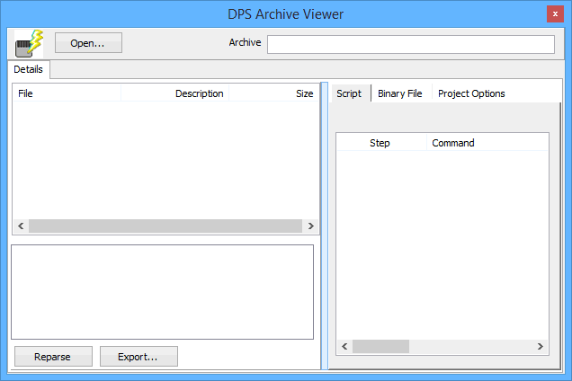

# DPS Archive Viewer

DPS Archive Viewer provides you with the ability to look inside a DPS archive file. To use this feature, click on the Open button and select a DPS archive. The files used in the archive will be listed on the left and the contents will be displayed on the right. The Reparse button at the bottom will reload the selected archive. Export will save a CSV file with a summary of the contents in the archive.

