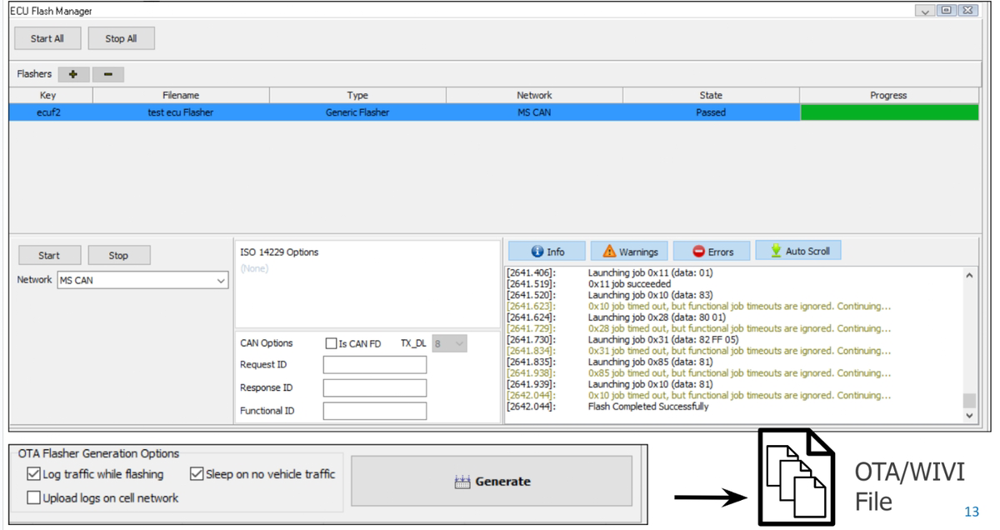

# 6. ECU Flash Manager View

Flash Manager View allows you to configure multiple flashers based on the different networks and ECU’s to help with the parallel flash. You can even configure parallel flash based on a different network and ECU’s.

To add a configuration, click on the plus icon, go to the generic flasher option, and select the ECU sequence from ECU Designer view. When you import a new sequence it will ask you to select your network that you want this sequence to run on.

Once the ECU is added, you will see the key, filename, type of flasher, network, and state of the flasher. You can choose to change the network configuration of each ECU and start them individually using the settings located on the bottom or use the start all ECUs to flash all your ECUs at the same time. ECU Flash Manager makes it easier to see the flash progress of each ECUs that is being flashed as well as preview the execution results on the bottom.

In addition, You can output an executable or exe application from Vehicle Spy, this means you have the capability to deploy multiple flashers across different users who may not ever need to change the flash sequence so you deploy this at a lower cost across your entire company.

<figure><figcaption></figcaption></figure>
