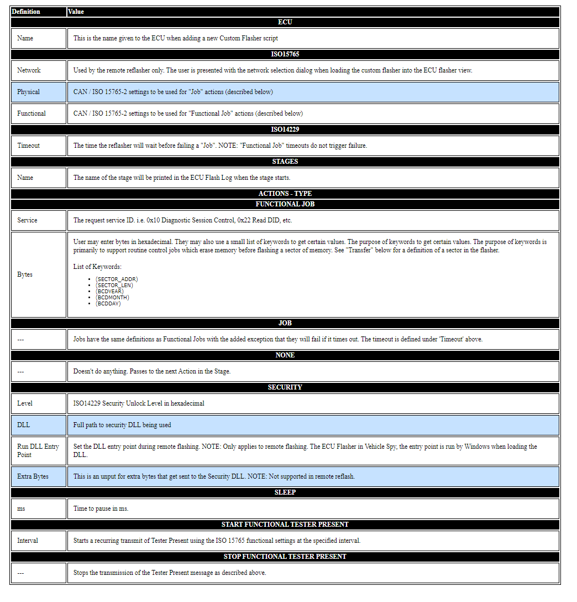

# Intrepid ECU Flasher: Definitions

### Transfer Action

The Transfer action is used to transmit data from an Intel HEX, S19, or VBF file. These file formats will contain multiple sectors, or contiguous blocks, of binary data. The ECU flasher can transfer sectors of data to the ECU and can also run Actions before any sector transfer happens, or it can run Actions before and/or after each sector in the associated file is run. The execution of the Transfer action follows the steps below:

* Execute 'before\_transfer\_for\_each\_sector'
* For each sector in the file:
  * keywords 'SECTOR\_ADDR' and 'SECTOR\_LEN' are updated for this sector
  * Execute 'before\_sector\_action'
  * Execute 'Request Download' job
  * Execute 'Multiple Transfer Data' job to transmit data
  * Execute 'after\_sector\_action'
* end

| TRANSFER                                    |                                                                                    |
| ------------------------------------------- | ---------------------------------------------------------------------------------- |
| File                                        | File path to the Intel HEX or S19 file.                                            |
| before\_transfer\_for\_each\_sector\_action | Action to be performed at the start of the transfer action. This only occurs once. |
| before\_sector\_action                      | Action to be performed prior to each sector request download / transfer data       |
| after\_sector\_action                       | Action to be performed after each sector request download / transfer data          |

### Transmit Action

The Transmit Action transmits an arbitrary message. This functions differently from calling a diagnostic job in that it will only transmit the defined message. Once the message is transmitted, execution immediately moves on to the next step.

| TRANSMIT |                                                                                             |
| -------- | ------------------------------------------------------------------------------------------- |
| ID       | The ARB ID for the Transmit Message. This value is in Hexidecimal.                          |
| Bytes    | The bytes that should be transmitted. This works as described under Funtional Job => Bytes. |
