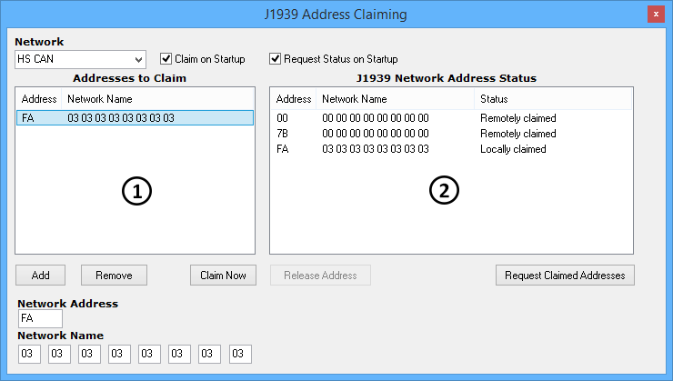

# J1939 Address Manager

J1939 requires every node on the network to claim a unique address before transmitting any data. Vehicle Spy supports this requirement with the [Embedded Tools](./) --> J1939 Address Manager\* that allows you to claim and view J1939 network addresses.

\*Note: J1939 must be enabled on the Tools -> Options, [Vehicle Networks tab](../main-menu-tools/tools-options/options-spy-networks-tab/) to see this selection.

Use the Network pulldown shown at the top of Figure 1 to choose which [Network](../main-menu-spy-networks/networks/setup-a-network.md) to work with. The rest of the view contains two areas. The left side is for claiming an address. The right side is for viewing addresses already claimed.

### Claim a J1939 Address

To claim a J1939 address for Vehicle Spy you must first fill in the desired one byte Network Address (in hexadecimal). The 8 bytes of the Network Name can also be filled in as needed. Next, click the "Add" button to add the Network Address and Name to the claim table on the left. Finally, click the "Claim Now" button to claim the address for Vehicle Spy. If "Claim on Startup" is enabled then Vehicle Spy will automatically claim the address in the table each time it goes online.

### View J1939 Addresses Already Claimed

If "Request Status on Startup" is enabled then Vehicle Spy will automatically request to see all addresses already claimed each time it goes online. All claimed addresses are displayed in the table on the right. To manually request which address have been claimed just click the "Request Claimed Addresses" button. Remotely claimed addresses have been claimed by other nodes on the network. Locally claimed means Vehicle Spy has claimed that address. A locally claimed address can be unclaimed by highlighting it with a left click and then clicking the "Release Address" button.
