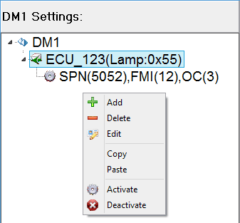
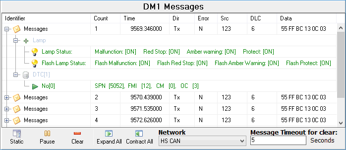

# J1939 DTC Monitor

Use the Embedded Tools --> J1939 DTC Monitor to simulate or view J1939 DM1 messages. J1939 must be enabled on the Tools -> Options, Vehicle Networks tab to see this selection.

DM1 messages are sent by J1939 ECUs to report their active DTCs (Diagnostic Trouble Codes) and related warning lamp status. DM1 messages have a PGN (Parameter Group Number) of 65226 ($FECA) and a periodic 1 s rate.

The J1939 DTC view contains two areas. The DM1 Settings area on the left is for simulating DM1 messages (Figure 1). The DM1 Messages area on the right is for viewing DM1 messages (Figure 2). Before simulating or viewing DM1 messages, use the Network pulldown at the bottom of the DM1 Messages area to choose which Network to work with.

### Simulate J1939 DM1 Messages (Figure 1)

Build DM1 messages that you would like Vehicle Spy to transmit by using the right mouse menu to Add, Delete, and Edit on highlighted branches in the DM1 tree. The main DM1 branch can support multiple data sources as long as each one has a unique address. In turn, each data source can support multiple DTCs. Each J1939 DTC is specified by entering data for these parameters:

* SPN - Suspect Parameter Number (0 to 524,287).
* FMI - Failure Mode Indicator (0 to 31).
* OC - Occurrence Count (0 to 127).

After the DM1 messages are built, use the right mouse menu to Activate and Deactivate them.

### View J1939 DM1 Messages (Figure 2)

The DM1 Messages area in Figure 2 is similar to the Messages view, but is filtered to only show DM1 messages. The Static/Scroll button toggles the view to scroll DM1 messages down the screen or keep them displayed in fixed locations based upon their source address. The Pause/Start button freezes and unfreezes the view. The Clear button clears the view, while leaving the Messages buffer unaffected. The Expand/Contract All buttons expand and contract all tree branches in the viewing area by controlling their +/- twisty buttons.

The "Message Timeout for Clear" value is an advanced feature related to Text API. This value determines how long an inactive DM1 source will remain listed as an active source before it gets removed from the list.

