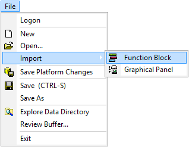

# Main Menu: File

The Vehicle Spy File main menu contains tasks for opening and saving files (Figure 1).

Refer to **Table 1** for a brief description of each File selection.

**Table 1: Vehicle Spy File Menu**

| File Menu Selection                                                                        | Description                                                          |
| ------------------------------------------------------------------------------------------ | -------------------------------------------------------------------- |
| [Logon](../../basic-operation-of-vehicle-spy/the-logon-screen.md)                          | Opens the Logon view.                                                |
| [New](../../basic-operation-of-vehicle-spy/create-open-and-save-vehicle-spy-setups.md)     | Creates a blank Vehicle Spy setup.                                   |
| [Open](../../basic-operation-of-vehicle-spy/create-open-and-save-vehicle-spy-setups.md)    | Opens an existing Vehicle Spy Setup.                                 |
| [Import > Function Block](import-function-blocks-and-graphical-panels.md)                  | Loads an exported Function Block (\*.vs3fb) into the current setup.  |
| [Import > Graphical Panel](import-function-blocks-and-graphical-panels.md)                 | Loads an exported Graphical Panel (\*.vs3gp) into the current setup. |
| Save Platform Changes                                                                      | Saves current Platform including the diagnostic database.            |
| [Save](../../basic-operation-of-vehicle-spy/create-open-and-save-vehicle-spy-setups.md)    | Saves current setup to the currently open file name.                 |
| [Save As](../../basic-operation-of-vehicle-spy/create-open-and-save-vehicle-spy-setups.md) | Saves the current setup to a new file (.vs3 or .vs3zip).             |
| [Explore Data Directory](../../basic-operation-of-vehicle-spy/data-directory.md)           | Opens the data directory of the logged on user.                      |
| [Review Buffer](review-buffer.md)                                                          | Opens a captured buffer in the Messages view.                        |
| Exit                                                                                       | Closes Vehicle Spy.                                                  |
