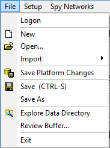

# Create, Open, & Save Vehicle Spy Setups

Use the Vehicle Spy File menu (Figure 1) to create, open, and save .vs3 and .vs3zip setup files.

 **New**: When Vehicle Spy opens, it creates a new setup by default. This selection forces Vehicle Spy to close all currently open views and start a new setup file.

 **Open**: This selection opens Vehicle Spy vs3 and vs3zip setup files. The [Logon](../../basic-operation-of-vehicle-spy/the-logon-screen.md) screen also provides a quick and convenient way to open setup files. It can be accessed anytime Vehicle Spy is not running via the File menu. Vector Canape (CNA) files can also be imported into Vehicle Spy through the Open menu.

 **Save**: This selection saves all Vehicle Spy settings in a vs3 or vs3zip setup file. Saving as a vs3 file will store settings such as message and signal definitions (receive & transmit tables only), filters, function blocks, graphical panels, custom column sets, diagnostic job setups, and selected signals for plotting and logging.

You can also open a setup, make changes, and save it under a different file name using the **Save As** operation.

Saving in a .vs3zip format will save a copy of all your databases in addition to the vs3 file in one file. This makes giving your setup to another co-worker simple. Open the .vs3zip and all the needed databases are configured and setup files are loaded.

**Warning**: Changing the name of a .vs3zip file outside of Vehicle Spy will cause database problems! To change a .vs3zip file name it should be opened in Vehicle Spy first and then saved as a .vs3zip with the new desired name.

**\*Note**: Saving a setup file via the File menu is different than pressing the Save button in Messages view. Saving in Messages view saves data (.csv) files. Selecting File> Save from the main menu saves setup (.vs3 or .vs3zip) files.

