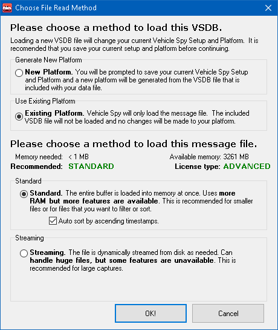

# Review Buffer

The [File](./)> Review Buffer selection can open standard (.CSV) or binary (.VSB) format Vehicle Spy buffer files for review. Other file formats are also supported. A browser dialog will open to the user's [Data Directory](../../basic-operation-of-vehicle-spy/data-directory.md). Select a file format and a buffer file and the [Messages view](../main-menu-spy-networks/messages-view/) will automatically open in scrolling mode displaying the buffer contents.

To see message and signal definitions applied to the buffer, first select a [Database](../main-menu-setup/network-databases.md) or use the [Messages Editor](../main-menu-spy-networks/message-editor/), then use Review Buffer to open the file.

Review Buffer can also be opened using the Messages view [bottom toolbar](../main-menu-spy-networks/messages-view/messages-view-bottom-toolbar/).

When a .VSB file is opened, Vehicle Spy will display a dialog with 2 options to choose how to load that file (Figure 1). The first options asks how to decode the data (Figure 1: ). The **New Platform**option will prompt to save your current setup and load a fresh Vehicle Spy workspace using a .VSDB database file to decode the messages. This option works well when reviewing data that was captured using [VehicleScape DAQ](../main-menu-measurement/vehiclescape-daq/). The **Existing Platform** option will use the current Vehicle Spy setup and database to decode the data.

The second option (Figure 1:) asks how to load the file. The **Standard** option demands more memory from the PC. Because of this, the files sizes it can work with are smaller. Using the Standard option, files load quick and more options to work with the file are available, for example time stamp sorting. The **Streaming** option was designed to work with larger files. This is because when the files are larger they take more time to load and sort. In most cases, Vehicle Spy will have the best choice selected by default.

