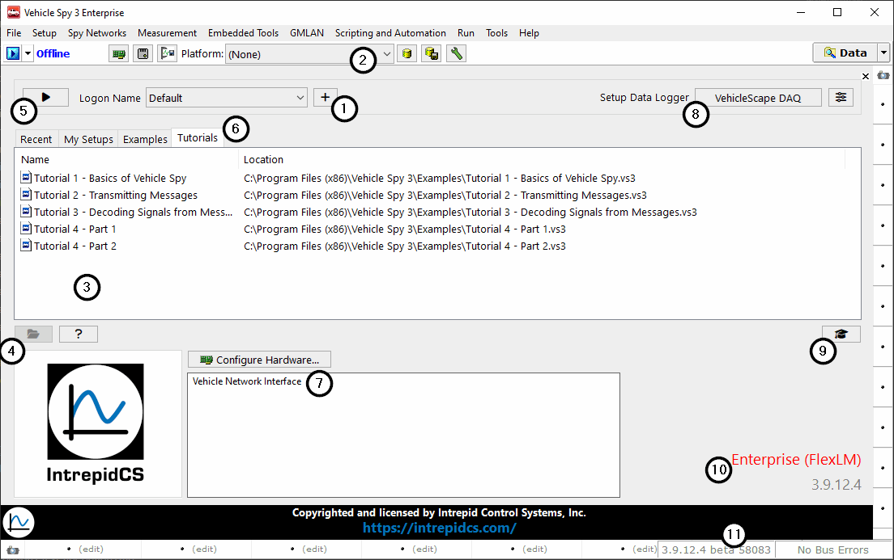

# The Logon Screen

After opening Vehicle Spy, the first screen displayed is the Logon screen (Figure 1). If Vehicle Spy has been used on the current PC before, click the drop down and select the desired logon name. If you have not used Vehicle Spy before or you wish to create a new logon name, press the **New** button (Figure 1:) and enter the name in the dialog that opens. Entering a logon name creates a [Data Directory](../../basic-operation-of-vehicle-spy/data-directory.md) folder of the same name within the Vehicle Spy Data Directory. This is the default location where all of your personal settings and data files will be stored.

For example, if a user logs in as "Jane Doe", a corresponding "Jane Doe" folder will be located at "C:\Program Files\Vehicle Spy 3\Data Directory\Jane Doe\\". (This assumes that Vehicle Spy was installed at C:\Program Files\Vehicle Spy 3\\.)

To remove a user, the user [Data Directory](../../basic-operation-of-vehicle-spy/data-directory.md) must be deleted.

When a name is selected, Vehicle Spy will load all of the custom information such as current databases and setup file selections.

Current Databases are displayed as platform names in a **pull down list** (Figure 1:). Each platform name represents an entire group of databases. Platforms and databases can be configured by clicking the  button to open the [Database Platforms](../main-menu-setup/network-databases.md) view.

Setup file selections appear in the area below the Current Databases field (Figure 1:). This area is divided into three sections, each with its own tab. Quickly switch between the sections by clicking on the desired tab. **Table 1** describes the function of each tab.

To open one of the listed files, simply select it and click the **Open** button (Figure 1:). You can also double click a selection and it will open automatically.

If you do not want to select a file from one of your lists, you can start with a new Vehicle Spy setup file by clicking the **Go** button (Figure 1:) or by selecting **File>New**.

**Table 1: Setup file selection tab descriptions**

| Tab       | Description                                                                       |
| --------- | --------------------------------------------------------------------------------- |
| Recent    | Lists the past 100 files you have opened.                                         |
| My Setups | Lists all setup files found in the current user's data directory.                 |
| Examples  | Lists useful example and tutorial setup files included with Vehicle Spy software. |

### Other Important Features

Quick links to useful tutorials are located below the file selection area (Figure 1:).

The Logon screen also shows what hardware is connected and will let you select a device if more than one unit is connected (Figure 1:). Simply right click on the hardware you want to use and click **Select Hardware**. The selected hardware will have a check mark  next to it. The  **Configure Hardware** button can be used to set the [baud rate](../main-menu-spy-networks/networks/setup-a-network.md) of the device.

When setting up a standalone logger, the **VehicleScape DAQ** button in the Setup DataLogger (Figure 1:) will open up [VehicleScape DAQ](../main-menu-measurement/vehiclescape-daq/) to help configure a logger. This is the same view as found by selecting Measurement>VehicleScape DAQ.
