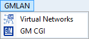

# Main Menu: GMLAN

The Vehicle Spy GMLAN main menu contains helpful tools for GM users as shown in Figure 1. Refer to Table 1 for a brief description of each selection.

**Note**: GMLAN must be enabled on the [Tools](../main-menu-tools/) -> [Options](../main-menu-tools/tools-options/), [Spy Networks tab](../main-menu-tools/tools-options/options-spy-networks-tab/) to see this menu.

**Table 1: Vehicle Spy GMLAN Menu**

| GMLAN Menu Selection                    | Description                                                              |
| --------------------------------------- | ------------------------------------------------------------------------ |
| [Virtual Networks](virtual-networks.md) | Opens Virtual Networks view to monitor states of GMLAN Virtual Networks. |
| [GM CGI](gm-cgi-bus.md)                 | Opens GM CGI view for viewing CGI data.                                  |
