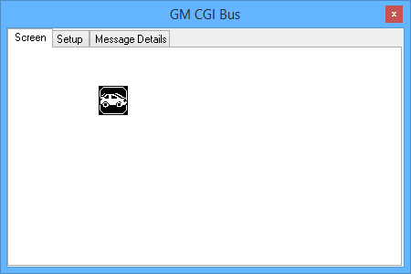
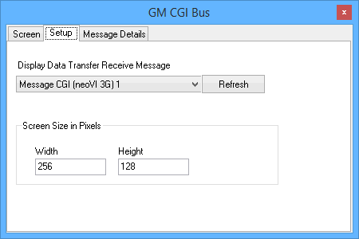
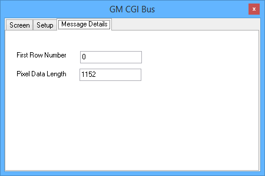

# GM CGI Bus

GM CGI Bus view is used for viewing CGI display data in Vehicle Spy. This view consists of 3 tabs. The first tab, Screen, is shown in Figure 1. This is the tab shows the image encoded in the selected message.

The Setup tab (Figure 2) is where the CGI message with Screen data is selected. This message must be defined in the receive table of the [Messages Editor](../main-menu-spy-networks/message-editor/). The next option to setup is the size of the screen. The Width and Height are entered in the Screen Size and is entered in Pixel units.

The last tab, Message Details (Figure 3), shows the start row and pixel count of the incoming graphic.

