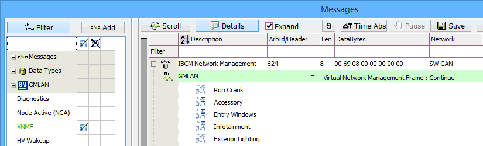
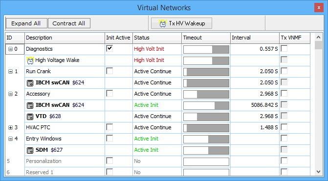

# Virtual Networks

The GMLAN -> Virtual Networks view in Vehicle Spy provides a unique and useful perspective for working with GMLAN virtual networks. Note: GMLAN must be enabled on the Tools -> Options, [Vehicle Networks tab](../main-menu-tools/tools-options/options-spy-networks-tab/) to see the GMLAN menu.

### Overview of VNs and VNMFs

If you already understand Virtual Networks (VNs) and Virtual Network Management Frames (VNMFs) then please [skip this overview](virtual-networks.md#virtual-networks-view) and jump below to see details of the tool. This brief overview is provided only as an aid for understanding and does not replace actual requirements from any specifications.

A "normal" network is a physical construct, like SWCAN, with ECUs exchanging messages. A normal network can be subdivided into VNs that are controlled by ECU software using VNMFs. Messages and signals are assigned to VNs and can be transmitted by ECUs only if their assigned VN is active.

VNs are activated and kept alive with VNMFs. Each ECU is assigned a unique VNMF ID. VNMF IDs are usually defined in a [UEF database](../main-menu-setup/network-databases.md), but can also be edited in the [ECUs](../main-menu-spy-networks/ecus-view/) view. A VNMF has bits assigned to each virtual network. A VNMF is sent by an ECU only to initialize or continue VNs.

A fun way to think of VNs and VNMFs is using an analogy with people playing with a beach ball at a concert. A person (ECU) starts (initializes) the game (VN) by hitting the ball (VNMF bit) into the air. People (ECUs) keep the ball (VNMF bit) in the air if they want to (continue) the game (VN). If nobody hits the ball then it falls to the ground (timeout) and the game (VN) stops.

Use the [Messages](../main-menu-spy-networks/messages-view/) view to see VNMFs sent by each ECU and the VNs being controlled by that ECU. Figure 1 shows an example of an ECU using a VNMF to continue some VNs.

### Virtual Networks view

The Virtual Networks view (Figure 2) uses a table to give perspective from a VN point of view, instead of the messages/ECU point of view shown in Figure 1. Each VN is shown with its status, timeout, and interval information. ECU details for each VN can be toggled using the Expand/Contract All buttons. Click the Tx HV Wakeup button to transmit a high voltage wakeup frame on the SWCAN network.

Refer to Table 1 for a description of each column in the Virtual Networks view.

| Virtual Networks Column | Description                                                                                                                                                                                                                        |
| ----------------------- | ---------------------------------------------------------------------------------------------------------------------------------------------------------------------------------------------------------------------------------- |
| ID                      | ID number of each VN. Click the +/- button to see more/less details regarding ECUs controlling the VN.                                                                                                                             |
| Description             | Name of each VN and ECU along with VNMF ID.                                                                                                                                                                                        |
| Init Active             | When enabled, information about any received high voltage wakeup frames (HVWF) will be included in the display.                                                                                                                    |
| Status                  | <ul><li>No - VN is not active.</li></ul><ul><li>High Volt Init - VN was initialized by HVWF.</li></ul><ul><li>Active Init - VN was initialized by an ECU.</li></ul><ul><li>Active Continue - VN was continued by an ECU.</li></ul> |
| Timeout                 | Bargraph indication of time remaining before VN expires from timeout.                                                                                                                                                              |
| Interval                | Time interval since last VNMF was received.                                                                                                                                                                                        |
| Tx VNMF                 | TBD                                                                                                                                                                                                                                |
