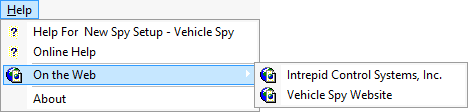

# Main Menu: Help

The Vehicle Spy Help main menu provides access to help documents, websites, and version information as shown in Figure 1. Refer to Table 1 for a brief description of each selection.

**Table 1: Vehicle Spy Help Menu**

|             Help Menu Selection             |                                   Description                                   |
| :-----------------------------------------: | :-----------------------------------------------------------------------------: |
|         Help for \<Vehicle Spy view>        |                Shows help topic for the currently selected view.                |
|                 Online Help                 | Displays the Vehicle Spy help documentation that is included with the software. |
| On the Web > Intrepid Control Systems, Inc. |                   Opens the Intrepid Control Systems website.                   |
|       On the Web > Vehicle Spy Website      |                          Opens the Vehicle Spy website.                         |
|                    About                    |                    Displays Vehicle Spy version information.                    |
