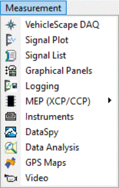

# Main Menu: Measurement

The Vehicle Spy **Measurement** menu (Figure 1) contains many features to facilitate the presentation and analysis of vehicle data.

**Figure 1: The Vehicle Spy Measurement menu.**

Table 1 contains a brief description of each of the items in the menu, with links to pages containing additional information.

**Table 1: Vehicle Spy Measurement Menu Items**

| Menu Item        | Description                                                                                                                                                                               |
| ---------------- | ----------------------------------------------------------------------------------------------------------------------------------------------------------------------------------------- |
| VehicleScape DAQ | Opens the VehicleScape DAQ feature to enable acquiring and logging various types of vehicle data.                                                                                         |
| Signal Plot      | Graphically displays signal data.                                                                                                                                                         |
| Signal List      | Displays a list of signal names and values.                                                                                                                                               |
| Graphical Panels | Allows you to define and use a set of custom user interfaces within Vehicle Spy. Note that the Floating Panels menu item appears when at least one graphical panel tool has been defined. |
| Logging          | Configures the logging of signal values based on specific parameters.                                                                                                                     |
| MEP (XCP/CCP)    | A submenu allowing access to Memory Edit Protocol (MEP) features, including measurement and calibration using XCP and CCP.                                                                |
| Data Analysis    | Opens the Data Analysis feature, which provides powerful options for plotting, analyzing and showing statistics for captured buffers and logs.                                            |
| GPS Maps         | Allows GPS location information in vehicle data to be graphically displayed on maps.                                                                                                      |
| Video            | Permits video data to be reviewed.                                                                                                                                                        |
