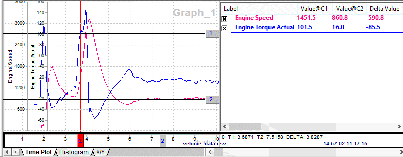

# Data Analysis: Channel Value Pane

The [Data Analysis](data-analysis/) Channel Value Pane can toggle plotter channels on/off and show channel specific measurements. It is an adjustable window pane located to the right of the plotter as shown in Figure 1. The entire pane can be toggled on and off using the "Show" [main menu](data-analysis/data-analysis-main-menus-and-toolbar.md) item.

The Channel Value Pane lists all channels selected from the [Tool Dialog](data-analysis-tool-dialog/). Click a channel checkbox to toggle the plotter display of that channel on and off.\
\
The channel measurement columns (Table 1) can be enabled on the Graph Legend tab on the [Plotter Options](data-analysis-plotter-area/data-analysis-plotter-options.md) window. Open the window by selecting "Options" from the right click menu or the "Configurations" main menu.\
\
Each column header in the channel list can be clicked to sort the column A-Z or Z-A. Also, the measurement columns can be rearranged by dragging and dropping their column headers to desired locations.

**Table 1: Channel Value Pane Measurements**

| Channel Measurement | Description                                                                                                                                            |
| ------------------- | ------------------------------------------------------------------------------------------------------------------------------------------------------ |
| Arb ID              | Arbitration ID of the message that the channel (signal) came from.                                                                                     |
| AvgRate             | Average delta time between timestamps for the data set located between the cursors.                                                                    |
| Delta Value         | Difference in y-axis values between the cursors. (Value@C2 - Value@C1)                                                                                 |
| DST J1939           | J1939 Destination of the message that the channel (signal) came from.                                                                                  |
| File Indx           | Index assigned to selected data files. Index value corresponds with the number on the data file tabs in the [Tool Dialog](data-analysis-tool-dialog/). |
| Max                 | Maximum y-axis value between the cursors.                                                                                                              |
| Mean                | Mean y-axis value between the cursors.                                                                                                                 |
| Median              | Median y-axis value between the cursors.                                                                                                               |
| Min                 | Minimum y-axis value between the cursors.                                                                                                              |
| No. Points          | Total number of points in the channel's data set.                                                                                                      |
| PGN J1939           | J1939 Parameter Group Number of the message that the channel (signal) came from.                                                                       |
| Prod                | Multiplied product of all y-axis values between the cursors.                                                                                           |
| Rate                | Delta time between timestamps.                                                                                                                         |
| SRC J1939           | J1939 Source of the message that the channel (signal) came from.                                                                                       |
| StdDev              | Standard deviation of all y-axis values between the cursors.                                                                                           |
| Sum                 | Sum of all y-axis values between the cursors.                                                                                                          |
| Type                | TBD                                                                                                                                                    |
| Value@C1            | Y-axis value of channel at cursor #1.                                                                                                                  |
| Value@C2            | Y-axis value of channel at cursor #2.                                                                                                                  |
| XValue@C1           | X-axis value of cursor #1.                                                                                                                             |
| XValue@C2           | X-axis value of cursor #2.                                                                                                                             |

There is an extensive right mouse menu while hovering over the Channel Value Pane. The right mouse menu selections are straightforward, but more help is available for the [Create calculated channel](data-analysis-tool-dialog/data-analysis-calculated-channels.md) selection.
