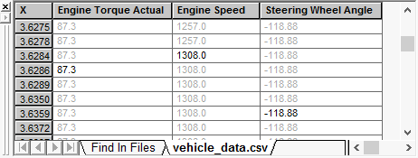

# Data Analysis: Output Bar

The [Data Analysis](data-analysis/) Output Bar (Figure 1) lists data points in selected channels. The Output Bar can be toggled on/off with the "Show" [main menu](data-analysis/data-analysis-main-menus-and-toolbar.md) item or by clicking the Main Toolbar button .

Columns are added for each channel selected in the data file. The "X" column lists the message timestamps from the Vehicle Spy data files.

For any channel, every value of X (timestamp) will have an actual or an interpolated channel value. Actual channel values from the data file are colored black. Interpolated channel values that are not in the actual data file are colored light gray.

Columns can be rearranged by clicking the column header to highlight the entire column then dragging and dropping the column header to the desired location.

Note: Help for the "Find In Files" tab remains TBD at this time.
