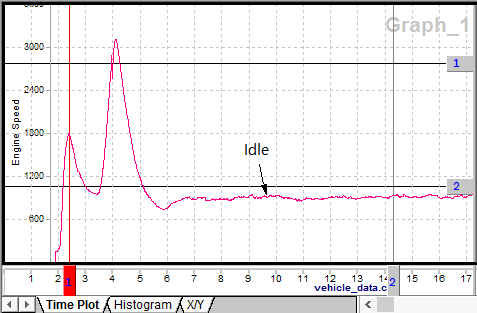

# Data Analysis: Plotter Area

The [Data Analysis](../data-analysis/) plotter graphs channels (or signals) found in data files. The plotter has many features giving it the flexibility to fit your needs.\
\
To graph a channel simply select a data file and a channel in the [Tool Dialog](../data-analysis-tool-dialog/). The channel can also be dragged and dropped from the Tool Dialog into the plotter. The x and y axes will automatically adjust to fit the data.\
\
In Figure 1 the two vertical lines numbered 1 and 2 are adjustable time cursors. Time cursors can help pinpoint data, assist with zoom control, and analyze channel statistics. A time cursor is activated using keyboard hotkeys 1 or 2 or by clicking on its handle with the tip of the mouse cursor. An active cursor will turn red and can be moved by double clicking on the plot or using drag and drop on its handle. The [Messages](../../main-menu-spy-networks/messages-view/) view will synchronize in time with the current location of the active cursor. ICS licensed 3G hardware (FIRE, Red, Yellow, VCAN3) must be connected for the time synchronization feature to work.

### Move the Plot

To move the plot using the mouse, click and hold on the x or y-axis and drag it. Release the mouse button to stop dragging the axis. The x-axis can also be moved with the mouse using the horizontal scrollbar just below the x-axis.\
\
To move the x-axis to a precise starting point use the [X-Axis Input Dialog](../data-analysis/data-analysis-x-axis-input-toolbar-and-dialog.md) start parameter.\
\
Use bookmarks to quickly jump to important locations that you flag along the x-axis. Bookmarks are set using the "Show" main menu. To use a bookmark, double click it in the list on the bookmark tab in the [Tool Dialog](../data-analysis-tool-dialog/).

### Scale the Plot

To scale the plot manually in the x or y directions, use the [Zoom Toolbar](../data-analysis/data-analysis-zoom-toolbar.md). To scale the x-axis to a precise width use the [X-Axis Input Dialog](../data-analysis/data-analysis-x-axis-input-toolbar-and-dialog.md) width parameter. To scale the y-axis to a precise height, double click on it to open a dialog, then adjust its Scaling values on the Graph tab.

### Plotter Labels and General Appearance

The graph has a default name assigned to it. The x-axis is labeled with the data file name. The y-axis is labeled with the channel name.\
\
The x-axis label cannot be edited. To change the graph or y-axis labels, double click on them and use the Edit Text Dialog. To add custom text or arrow labels, use the [Main Toolbar](../data-analysis/data-analysis-main-menus-and-toolbar.md).\
\
Display features such as colors, line styles, and font styles can be changed using the [Plotter Options](data-analysis-plotter-options.md) window. This window is opened by selecting "Options" from the right click menu or the "Configurations" main menu.\
\
Once you have the plot looking like you want you can copy it to the clipboard using the "Edit" main menu.

### Advanced Plotting Methods

The plotter can do much more than graph just one data file and one channel versus time. Please refer to [advanced plotting methods](data-analysis-advanced-plotting-methods.md) for more details.
