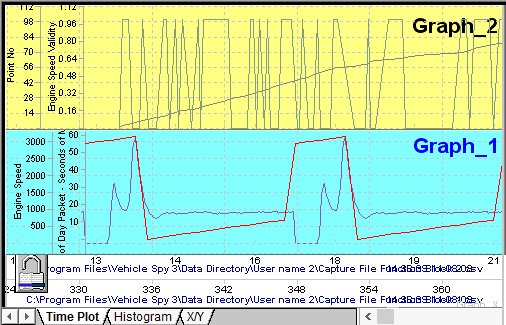
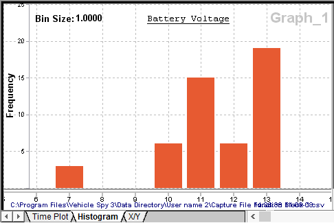
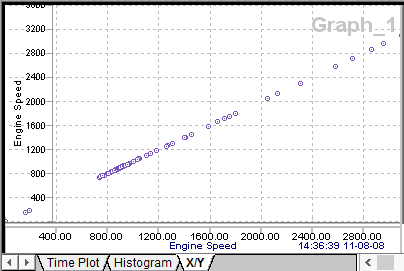
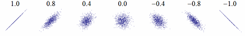

# Data Analysis: Advanced Plotting Methods

The [plotter area](./) in [Data Analysis](../data-analysis/) can do much more than graph one data file and one channel versus time. Please take a look at Figure 1 to see an example of a more complex Time Plot.

### Time Plot

Notice the plotter has two graphing areas instead of one. This is accomplished by clicking the Add Graph button on the [Page Setup Toolbar](../data-analysis/data-analysis-plotter-setup-toolbar.md).\
\
The plotter has two x-axis because two different data files were selected on the [Tool Dialog](../data-analysis-tool-dialog/). Each x-axis can be moved independently or they can be locked together by clicking on the padlock button.\
\
Four channels are being graphed simultaneously and each one has its own y-axis that can be moved and scaled independently.\
\
Time Plots with multiple graphs, data files, and channels are just one way to visually analyze your data files.

### Histogram

Select the Histogram tab in the plotter as another way to analyze channels. A histogram is a bar chart showing the frequency of data points in the channel's data set as shown in Figure 2. Each bar on the chart represents bins of equal width. The height of each bar represents how many times the values of x occurred within that bin. When a channel is selected for a histogram, the plotter calculates and displays the bin size, autoscales the axes, and graphs the bar chart. To change the bin size or start and end points, double click the x-axis and use the dialog.

In the example in Figure 2 a battery voltage channel containing 50 data points was selected. The resulting histogram shows most of the data points are around 11-12 and 13-14 volts. (Bin size = 1 means all values 0-1V are plotted at x=0, values 1-2V plotted at x=1, etc.)

### X/Y (Scatter Plot)

The X/Y tab is scatter plotting tool for estimating the correlation between two channels. The scatter plot is a collection of data points without any lines connecting them as shown in Figure 3. The x/y coordinates of each data point come from single channels dragged and dropped onto the x and y-axis.

The simple example in Figure 3 shows perfectly correlated channels. The correlation is perfect because the exact same channel was dragged onto each axis.

In general, points tightly following a straight line indicate strong correlation. Widely scattered points forming a cloud indicates little correlation between the channels. See Figure 4 for examples of scatter plots and their correlation values. Correlation can be a tricky business because tightly correlated data suggests one thing causes the other, but this is not necessarily correct. Please refer to excellent resources on the internet for further help about scatter plots and correlation.

