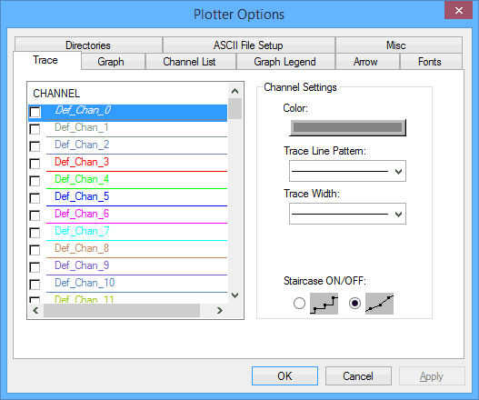

# Data Analysis: Plotter Options

The Plotter Options dialog (Figure 1) configures most aspects of the plotter area, the default directories, and ASCII data file parameters.\
\
Plotter Options can be opened using the [Data Analysis](../data-analysis/) main menu [Configurations](../data-analysis/data-analysis-main-menus-and-toolbar.md#configurations-menu) -> Options selection. It can also be opened using the right mouse menu "Options" selection while over the [Tool Dialog](../data-analysis-tool-dialog/), plotter, or [Channel Value Pane](../data-analysis-channel-value-pane.md) areas.

Table 1 gives descriptions of what each Plotter Options tab is for.

**Table 1: Plotter Options Tabs**

****

| Plotter Options Tab | Description                                                                                                                                                                                                                          |
| ------------------- | ------------------------------------------------------------------------------------------------------------------------------------------------------------------------------------------------------------------------------------ |
| Trace               | Settings for channel colors, line patterns, line widths, and staircase vs straight line for connecting data points.                                                                                                                  |
| Graph               | Settings for graph color, axis scaling, tick mark locations, and grid lines.                                                                                                                                                         |
| Channel List        | On/off toggle for each channel measurement column in the [Tool Dialog](../data-analysis-tool-dialog/).                                                                                                                               |
| Graph Legend        | On/off toggle for each channel measurement column in the [Channel Value Pane](../data-analysis-channel-value-pane.md).                                                                                                               |
| Arrow               | Controls the color and style of arrow labels made using the "[Annotation](../data-analysis/data-analysis-main-menus-and-toolbar.md#annotation-menu)" main menu or equivalent Main Toolbar buttons.                                   |
| Fonts               | Font color, style, and size settings for the y-axis labels and the text labels made using the "[Annotation](../data-analysis/data-analysis-main-menus-and-toolbar.md#annotation-menu)" main menu or equivalent Main Toolbar buttons. |

| Directories      | Default directory locations for files that can be saved and loaded by the Data Analysis tool.                                 |
| ---------------- | ----------------------------------------------------------------------------------------------------------------------------- |
| ASCII File Setup | Customize expected data file extensions. Also change data file structures for channel labels, x-axis values, and data values. |
| Misc             | Most miscellaneous selections are clearly described. ("Convert VSpy data from selected dbase files" remains TBD.)             |
