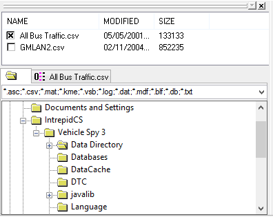
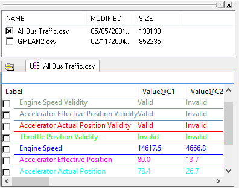

# Data Analysis: Tool Dialog

The Tool Dialog (Figure 1) is mainly used for selecting data files and the channels within those files. The window is docked in the upper left portion of the [Data Analysis](../data-analysis/) view, but can be docked on either side of the plotter. The [Show](../data-analysis/data-analysis-main-menus-and-toolbar.md#show-menu) menu can toggle the Tool Dialog display on and off.\
\
The upper half is the data file selection list. The lower half has a directory tab (active in Figure 1) and selected data file tabs.

### Selecting Data Files

Directories contain data files and data files contain channels (or signals). The upper half of the Tool Dialog displays files in the currently selected directory. Simply click the checkbox next to a data file name to select it.\
\
If the selected data file contains valid signal information then various things will happen. First, the Messages view will display the data file contents and be synchronized in time with the Data Analysis plot x-axis. Second, a numbered tab for the data file is created in the Tool Dialog. Third, an x-axis is added to the [plotter area](../data-analysis-plotter-area/).\
\
As an example, Figure 1 shows the directory "User name 2" is selected. The checkboxes for the first two data files in that directory are also selected. Each data file gets a numbered tab (0 and 1) because they both have valid signal information. Although not shown here, the plotter area will have two x-axes.\
\
The text field just above the directory tree filters for specific file extensions. Leave the filter field blank to see all files in a directory. Click on other folders in the tree to find data files in other directories.

### Selecting Channels

To select a channel, first display a channel list by clicking on a numbered data file tab. Next, click the checkbox next to the desired channel as shown in Figure 2. Whenever a channel is selected these areas in Data Analysis are updated:

* A new plot with its own y-axis is generated.
* The channel is added to the [Channel Value Pane](../data-analysis-channel-value-pane.md).
* The [Output Bar](../data-analysis-output-bar.md) adds a column showing all data points in the channel.

Channel measurement columns can be enabled with the [Plotter Options](../data-analysis-plotter-area/data-analysis-plotter-options.md) window, Channel List tab. Open the window by selecting "Options" from the right click menu or the "Configurations" main menu. Descriptions of each channel measurement are in the [Channel Value Pane](../data-analysis-channel-value-pane.md) help topic because the same measurements can be displayed there too.\
\
Each column header in the channel list can be clicked to sort the column A-Z or Z-A. Also, the measurement columns can be rearranged by dragging and dropping their column headers to desired locations.\
\
The entry field just above the channel column headers is used to filter the channel list. In Figure 2 for example, the text "speed" is being used to only show channel labels containing the text "speed". Leave the filter field blank to see all channels in the data file.\
\
There is an extensive right mouse menu while hovering over the channel selection list. The right mouse menu selections are straightforward, but more help is available for the [Create calculated channel](data-analysis-calculated-channels.md) selection.
