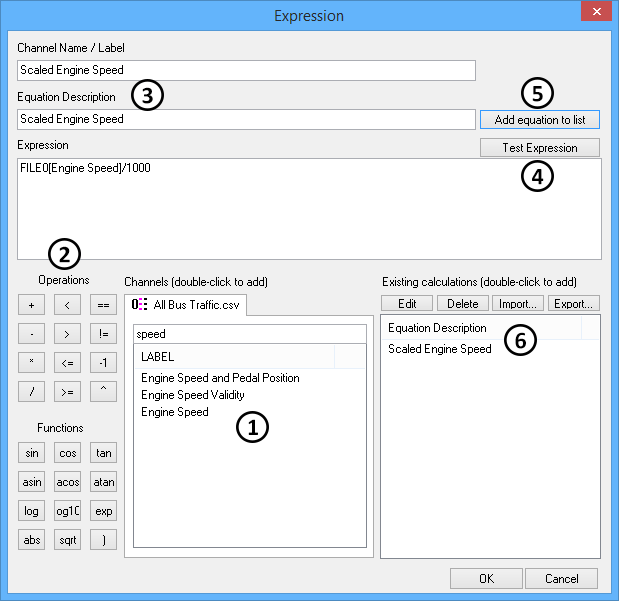

# Data Analysis: Calculated Channels

The [Data Analysis](../data-analysis/) tool can plot channels extracted from data files, but it can also create and plot new channels using calculations based upon extracted channels.\
\
Calculated channels are created using the Expression dialog shown in Figure 1. To open the Expression dialog, right click on the channel list in either the [Tool Dialog](./) or [Channel Value Pane](../data-analysis-channel-value-pane.md) areas. Next, select "Create a calculated channel" and the dialog will open.

### Build Calculated Channels (refer to Figure 1)

Build the calculated channel expression using data files, channels, operations and functions. Select channels by double clicking on them at location . Select operations and functions by clicking the items shown at . Enter numerical constants by typing directly in the Expression field.\
\
Give the new calculated channel a name and description at . When finished, click the Test Expression button  to see if the expression will compile ok. If it is not ok, fix the errors and test the expression again.\
\
After the expression tests ok, add the calculated channel to the existing list by clicking the "Add equation to list" button . Click Ok on the Expression dialog to close it and see your new calculated channel in the channel list.

### Manage Calculated Channels 

Calculated channels can be edited and deleted by simply selecting them in the list and clicking the Edit or Delete buttons. The entire list of calculated channels can be imported and exported as \*.exp files.
