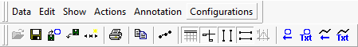

# Data Analysis: Main Menus and Toolbar

The [Data Analysis](./) main menus and associated toolbar are shown in Figure 1. Each menu is covered individually in a section below, with a table describing each menu's options. When present, the icon on the main toolbar representing the command is also displayed.\
\
You can click on one of the menu names just below to jump straight to its section.

&#x20;                      [**Data**](data-analysis-main-menus-and-toolbar.md#data-menu) **---** [**Edit**](data-analysis-main-menus-and-toolbar.md#edit-menu) **---** [**Show**](data-analysis-main-menus-and-toolbar.md#show-menu) **---** [**Actions**](data-analysis-main-menus-and-toolbar.md#actions-menu) **---** [**Annotation**](data-analysis-main-menus-and-toolbar.md#annotation-menu) **---** [**Configurations**](data-analysis-main-menus-and-toolbar.md#configurations-menu)

### Data Menu

The **Data Menu** is used to open, close and save data files, and to set print options and print plots. It is described in Table 1.

**Table 1: Data Menu Commands**

| Command                      | Toolbar Icon                                                                          | Description                                                                                                                                                                                                          |
| ---------------------------- | ------------------------------------------------------------------------------------- | -------------------------------------------------------------------------------------------------------------------------------------------------------------------------------------------------------------------- |
| Open                         |                 | Opens a data file for analysis. Can only be selected if a file is not already open.                                                                                                                                  |
| Close                        |                                                                                       | Closes the currently opened data file.                                                                                                                                                                               |
| Save                         |                 | Saves formatting and screen configuration information, as well as all data, to a data file in Matlab File format (**.mat**). This will not overwrite the existing data file unless a Matlab file was already opened. |
| Save As                      |                                                                                       | Same as the **Save** command, but allows you to select a new file name before saving.                                                                                                                                |
|                              |                                                                                       |                                                                                                                                                                                                                      |
| Add a File to Current Plot   |  | This command is deprecated (opening multiple files in Data Analysis is no longer supported).                                                                                                                         |
| Remove Active File from Plot |       | Removes the current file from the plot. Since only one file can be open at present, this command is now equivalent to selecting **Close**.                                                                           |
| Save Data to a Subset File   |         | Opens a dialog box to allow you to save a data file in a different format, or to save part of a large data file to a different file.                                                                                 |
|                              |                                                                                       |                                                                                                                                                                                                                      |
| Print                        |                    | Opens a dialog box to allow you to print the current plot. You can select the printer, print range, and number of copies to print.                                                                                   |
| Print Preview                |                                                                                       | Shows a print preview of the current plot in the plotter area.                                                                                                                                                       |
| Print Setup                  |                                                                                       | Opens a dialog to let you select the network, printer, paper size, and paper orientation for printing.                                                                                                               |
|                              |                                                                                       |                                                                                                                                                                                                                      |
| Recent Files                 |                                                                                       | At the end of the **Data** menu is a list of the most recently opened data files, to make it easier for you to find them again if needed.                                                                            |

### Edit Menu

The **Edit Menu** currently contains just the **Copy** command, described in Table 2.

**Table 2:** Edit Menu Commands

| Command       | Toolbar Icon | Description                                                                               |
| ------------- | ------------ | ----------------------------------------------------------------------------------------- |
| Copy          |              | Copies the current plot to the Windows clipboard so it can be pasted into other programs. |
|               |              |                                                                                           |
| Find in Files |              | This command is currently not implemented.                                                |

### Show Menu

The **Show** **Menu** is used to enable or disable toolbars and other areas of the Data Analysis view, as well as to control cursors in the plotter area. Its commands can be found in Table 3.

**Table 3: Show Menu Commands**

| Command                                                                                                                                | Toolbar Icon                                                                     | Description                                                                                                   |
| -------------------------------------------------------------------------------------------------------------------------------------- | -------------------------------------------------------------------------------- | ------------------------------------------------------------------------------------------------------------- |
| 
Main Toolbar / Zoom Toolbar / Status Bar / Tool Dialog / Channel Value Pane / X-Axis Input Dialog / Plotter Setup Toolbar
 |                                                                                  | Set or clear the checkbox next to any of these items to display or hide the associated area of Data Analysis. |
| Output Bar                                                                                                                             |      | Toggles the Output Bar on or off.                                                                             |
|                                                                                                                                        |                                                                                  |                                                                                                               |
| Zoom In                                                                                                                                |                                                                                  | This command is currently not implemented.                                                                    |
| Undo Zoom                                                                                                                              |                                                                                  | This command is currently not implemented.                                                                    |
|                                                                                                                                        |                                                                                  |                                                                                                               |
| Refresh Screen                                                                                                                         |                                                                                  | This command is currently not implemented.                                                                    |
| View Cursor Position Values                                                                                                            |  | Toggles the display of mouse cursor position values in the plotter area on or off.                            |
| View Time Cursors                                                                                                                      |     | Toggles both vertical line cursors in the plotter area on or off.                                             |
| View Data Points                                                                                                                       |      | Toggles the highlighting of individual data points on or off for all plotted channels.                        |

### Actions Menu

The **Actions** **Menu** allows you to access controls for the X axis and to remove channels from the current plot; see Table 4.

| Command                            | Toolbar Icon | Description                                                                                    |
| ---------------------------------- | ------------ | ---------------------------------------------------------------------------------------------- |
| Change X-Axis Limits               |              | Opens the [X-Axis Input Dialog](data-analysis-x-axis-input-toolbar-and-dialog.md) window.      |
| Remove selected channels from plot |              | After selecting a number of channels, choose this option to remove them from the current plot. |

### Annotation Menu

This menu allows you to document or label your plots by adding arrows or text to them, which can be set to either remain stationary or move with channels to which they are linked. Table 5 contains this menu's commands.

**Table 5: Annotation Menu Commands**

| Command                       | Toolbar Icon                                                                                | Description                                                                                       |
| ----------------------------- | ------------------------------------------------------------------------------------------- | ------------------------------------------------------------------------------------------------- |
| Add Data Relative Text        |     | Adds text to the plot positioned relative to a data channel, which moves as the channel does.     |
| Add Data Relative Arrow       |    | Adds an arrow to the plot positioned relative to a data channel, which moves as the channel does. |
|                               |                                                                                             |                                                                                                   |
| Add Screen Relative Text      |   | Adds text to the plot that is positioned relative to the view area, independent of channel plots. |
| **Add Screen Relative Arrow** |  | **Adds an arrow on the plot positioned relative to the view area, independent of channel plots.** |

To work with an annotation, first click on it to select it, then perform one of these actions::

* **Move:** Hover the mouse pointer over the text or arrow until it changes to a four-arrow cursor. Then click and drag the annotation to new location.
* **Delete:** Press the **Delete** key on the keyboard.
* **Edit Properties:** Double-click the annotation after it is selected to open a properties dialog box.

### Configurations Menu

Use this menu to save or load Data Analysis configurations, and set options for an object, a graph or the plotter as a whole. The menu commands are shown in Table 6.

**Table 6: Configuration Menu Commands**

| Command                    | Toolbar Icon | Description                                                                                                                           |
| -------------------------- | ------------ | ------------------------------------------------------------------------------------------------------------------------------------- |
| Start new configuration    |              | Resets the configuration to default values to start a new configuration.                                                              |
| Save current configuration |              | Saves the current configuration to a **.cfg** file.                                                                                   |
| Load configuration         |              | Load a previously saved configuration **.cfg** file.                                                                                  |
|                            |              |                                                                                                                                       |
| Selected Object Options    |              | Opens the [Plotter](../data-analysis-plotter-area/data-analysis-plotter-options.md) Options dialog for the currently selected object. |
| Selected Graph Options     |              | Opens the [Plotter](../data-analysis-plotter-area/data-analysis-plotter-options.md) Options dialog showing graph options.             |
| Selected Y-Axis Options    |              | Opens the [Plotter](../data-analysis-plotter-area/data-analysis-plotter-options.md) Options dialog showing Y-axis options.            |
| Program Default Options    |              | Opens the Plotter Options dialog showing all options. Options set here become program defaults.                                       |
|                            |              |                                                                                                                                       |
| About                      |              | Displays the current version of the Data Analysis feature.                                                                            |
