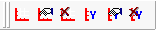

# Data Analysis: Plotter Setup Toolbar

The Plotter Setup Toolbar (Figure 1) allows you to add, edit and delete graphs in the [Plotter Area](../data-analysis-plotter-area/), and also to add, edit and delete Y axes on any graph. This toolbar is hidden by default when you run Vehicle Spy; you can enable it by adding a checkmark next to its entry in the [Show Menu](data-analysis-main-menus-and-toolbar.md#show-menu).

Table 1 describes each of the buttons on the Plotter Setup Toolbar.

**Table 1: Plotter Setup Toolbar Icons and Commands**

| Command       | Toolbar Icon                                                                         | Description                                                                                                                                                                                                                                                                                                                                                                           |
| ------------- | ------------------------------------------------------------------------------------ | ------------------------------------------------------------------------------------------------------------------------------------------------------------------------------------------------------------------------------------------------------------------------------------------------------------------------------------------------------------------------------------- |
| Add Graph     |     | Adds a new graph to the Plotter Area, splitting it into equally-sized regions for each graph. A maximum of 32 graphs are allowed.                                                                                                                                                                                                                                                     |
| Edit Graph    |    | Select a graph by clicking on it, then press this button to open its [Plotter Options](../data-analysis-plotter-area/data-analysis-plotter-options.md) dialog box, where you can set options such as colors, line styles and grid line parameters. This is equivalent to choosing **Selected Graph Options** from the [Configurations Menu](data-analysis-main-menus-and-toolbar.md). |
| Delete Graph  |  | Press this button to delete the selected graph; you will be asked to confirm the operation. The remaining graphs will have their sizes adjusted so the Plotter Area remains evenly divided. This button is disabled if there is only one graph in the Plotter Area.                                                                                                                   |
|               |                                                                                      |                                                                                                                                                                                                                                                                                                                                                                                       |
| Add Y-Axis    |     | Adds a Y axis to a graph. When you click on this button, the mouse pointer will change to appear similar to the button's icon. Hold the mouse button down and drag from the button to the graph where you want the new Y axis added, then release the button.                                                                                                                         |
| Edit Y-Axis   |    | Select a Y axis by clicking on it, then press this button to open its Plotter Options dialog box, where you can set axis parameters. This is the same as choosing **Selected Y-Axis Options** from the Configurations Menu.                                                                                                                                                           |
| Delete Y-Axis |  | Deletes the selected Y axis. There is no confirmation for this operation, so be sure that you first select the correct axis. This button is disabled when a graph has only one Y axis.                                                                                                                                                                                                |
