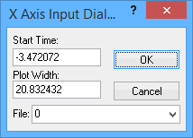

# Data Analysis: X-Axis Input Toolbar and Dialog

The X-Axis Input Toolbar and Dialog are alternatives to the [zoom toolbar](data-analysis-zoom-toolbar.md) for controlling the X-axis range of data displayed in the [Plotter Area](../data-analysis-plotter-area/). Instead of manipulating the zoom level using the mouse, you enter the exact values of the X-axis range that you want to display. This allows you to easily move to specific parts of a channel display, which is especially useful when dealing with large data files.

### X-Axis Input Toolbar

The toolbar is shown in Figure 1. Like other toolbars, it appears at the top of the Data Analysis window, and can be hidden by removing the checkmark next to it in the [Show Menu](data-analysis-main-menus-and-toolbar.md).

The toolbar consists of three input parameters and a button:

* **S (Start):** Sets the starting value of the X axis for the plot.
* **W (Width):** Sets the width of the plot.
* **F (File):** Formerly used to select a file number, this should now always be 0.
* **do**
* : Press this button to apply any changes entered in the other fields.

Files can also be scrolled using the scroll bar located at the bottom of the Plotter Area. Clicking the scroll bar, or dragging the box within it, will shift the plot, automatically updating the**S** parameter in the X-axis input toolbar. This allows you to move quickly through large files.

### X-Axis Input Dialog

Double-clicking the X-axis in the Plotter Area will launch a dialog box (Figure 2) that contains the same elements as the X-axis input toolbar, and is used in a similar manner. This dialog will still work if you have the toolbar hidden, making it handy when screen real estate is at a premium.

