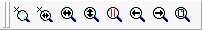

# Data Analysis: Zoom Toolbar

The Zoom Toolbar (Figure 1) contains a number of tools to allow you to adjust the zoom level in both dimensions of your plots, so you can pinpoint exactly the data you want to see. It appears at the top of the Data Analysis area like other toolbars, but can be hidden by removing the checkmark next to it in the [Show Menu](data-analysis-main-menus-and-toolbar.md#show-menu).

Table 1 describes each of the buttons on the Zoom Toolbar.

**Table 1: Zoom Toolbar Icons and Commands**

| Command                  | Toolbar Icon                                                                         | Description                                                                                                                                                                                                                                                                                                                                                                                                                                        |
| ------------------------ | ------------------------------------------------------------------------------------ | -------------------------------------------------------------------------------------------------------------------------------------------------------------------------------------------------------------------------------------------------------------------------------------------------------------------------------------------------------------------------------------------------------------------------------------------------- |
| Zoom Box (Both Axes)     |        | 
Zoom in to fill the plot display with a selected rectangular area.  To use this command, press this button once; a zoom cursor will appear. Click in one corner of the plot display range you want to zoom in on, then drag to create a rectangular selection area. Release the mouse button at the opposite corner, and Vehicle Spy will zoom in to show the selected two-dimensional region.
                                        |
| Zoom Box (X Axis)        |   | 
Zoom in to fill the plot based on a selected range of X axis values.  To use this command, press this button once; a zoom cursor will appear. Click at one end of the X axis range you want to zoom in on, then drag the mouse; a pair of vertical bars will appear showing the currently selected area. Release the button at the other end, and Vehicle Spy will zoom in to show the plot with the selected range of X axis values.
 |
| Zoom in X Direction      |         | Zoom in the X axis a fixed amount. Each press of the button will magnify the plot horizontally by focusing in on a smaller range of X axis values.                                                                                                                                                                                                                                                                                                 |
| Zoom in Y Direction      |         | Zoom in the Y axis a fixed amount. Each press of the button will magnify the plot vertically by focusing in on a smaller range of Y axis values.                                                                                                                                                                                                                                                                                                   |
| Zoom Between Cursors     |    | Zoom in the plot so that the X axis displays the range between the current vertical cursors. (A small amount of extra space is shown on either side for context.)                                                                                                                                                                                                                                                                                  |
| DisplayOnlyZoom Previous |  | Zoom in the plot so that the X axis displays the range between the current vertical cursors. (A small amount of extra space is shown on either side for context.)                                                                                                                                                                                                                                                                                  |
| Zoom Next                |      | Redo the last undone zoom operation to go forward to the next selected zoom level.                                                                                                                                                                                                                                                                                                                                                                 |
| Zoom Full Page           |    | Reset the zoom state to default, filling the plot area with current signal data                                                                                                                                                                                                                                                                                                                                                                    |
