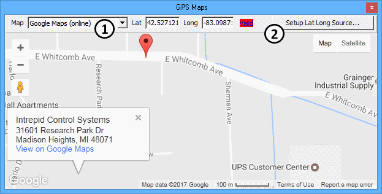
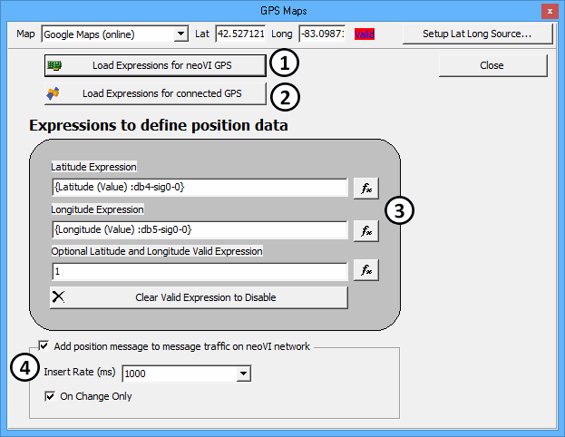
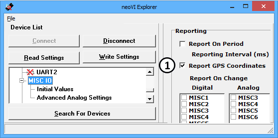
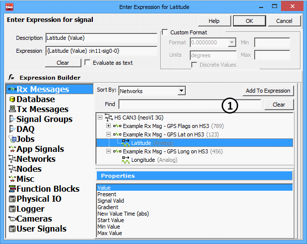

# GPS Maps

**GPS Maps** shows Global Positioning System data on a map overlay in real-time or from previously logged data. The GPS data can come from ICS logger hardware, from a GPS receiver, or from in-vehicle network messages sent by an ECU. GPS Maps is opened from the Measurement main menu.

Note: GPS Maps requires an active internet connection to access map applications found outside of Vehicle Spy.

Follow these general steps to use GPS Maps in Vehicle Spy:

1. Select a map application in GPS Maps.
2. Setup the GPS Maps lat/long inputs to match the source of GPS data.
3. Take Vehicle Spy online with ICS hardware to see data in real-time...\
   ...OR online in simulation mode with a previously saved buffer file to replay it at different speeds.

### Select a Map Application

The **Map** dropdown (Figure 1:) selects which internet map application to use. Click and drag on the map to move it around and use the mouse wheel to zoom in and out. Each map application has custom built-in features and outside sources of help, so they are not explained further here.

**Lat** and **Long** show the latitude and longitude (in degrees) of the current map cursor location.

The **red box** is an optional validity flag to help describe the GPS data. The flag can show blank or "Valid" depending upon the result of a custom equation set up for the GPS data source. GPS Maps updates the display only if the red box shows "Valid".

### Set Up the GPS Data Source

Click **Setup Lat Long Source** (Figure 1:) to open the setup dialog (Figure 2) and match the input expressions to one of these types of GPS data sources:

* ICS logger
* GPS receiver
* Vehicle ECU

### GPS Data Source = neoVI GPS (ICS Logger)

Some ICS loggers have a GPS receiver that can log GPS data to a virtual "neoVI" network. The messages and their signals are predefined in Vehicle Spy's Messages Editor, Database view, neoVI network with ArbIDs $110 to $116. Click **Load Expressions for neoVI GPS** (Figure 2:) to set the input expressions for GPS Maps to match the neoVI network database signals.

On a related note, ICS logger GPS reporting at a 255 ms periodic rate can be enabled using either of these methods:

* VSpy Setup Hardware, neoVI Explorer Connect, MISC IO, set **Report GPS Coordinates** = ON, Write Settings. (Figure 3:)
* CoreMini function block script, Set Value command, Expression Builder, Misc/GPS, set **GPS Enable** = 1.

### GPS Data Source = Connected GPS (GPS Receiver)

Vehicle Spy can acquire data directly from a GPS receiver connected to a PC serial communications port. The link is setup on the Tools -> Options -> GPS tab. The GPS data is available in the Expression Builder under Misc/GPS. Click **Load Expressions for connected GPS** (Figure 2:) to set the input expressions for GPS Maps to match the Expression Builder Misc/GPS signals.

### GPS Data Source = Custom Expressions (Vehicle ECU)

Many vehicles have an ECU transmitting GPS data across in-vehicle networks to other ECUs. Vehicle Spy can monitor the in-vehicle networks, decode the GPS messages from the ECU, and display the data on GPS Maps.

The GPS messages and their signals must first be defined in Vehicle Spy's Messages Editor Receive or Database views. Once defined, the GPS signals can then be assigned to the GPS Maps **Latitude** and **Longitude** expressions by clicking their **fx button** (Figure 2:) and using the Expression Builder. (Figure 4)

The **Optional Latitude and Longitude Valid Expression** is meant for handling the validity of GPS data which can suffer due to weather, long tunnels, poor connections, etc. The expression can be anything made with the Expression Builder, but it has the following impacts depending upon its result:

* Result 0 = GPS Maps freezes on last lat/long values used and sets red box to blank.
* Result 1 = GPS Maps updates lat/long values and red box shows Valid.
* No expression = GPS Maps ignores the expression; so it updates lat/long values and red box shows Valid.

### Send GPS Maps Data to the neoVI Network (Optional)

If the GPS data source\* is a GPS Receiver or Vehicle ECU then GPS Maps can gate the GPS data to the neoVI network by transmitting database GPS messages $110 to $112. To enable the feature, set the checkbox ON for **Add position message to message traffic on neoVI network**. (Figure 2:) Select an **Insert Rate (ms)** to set the periodic rate of the neoVI network messages. If **On Change Only** is enabled then the messages are sent only when the data differs from the previous transmission.

\*Note: Do NOT use this feature if the GPS data source is an ICS logger; it uses the neoVI network as an INPUT to GPS Maps.
