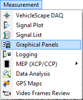

# Graphical Panels

Vehicle Spy's Graphical Panels view allows the creation of custom user interfaces. A number of different [tools](graphical-panels-tools/) can be [added](graphical-panels-add-or-delete-a-tool.md) to each panel, including graphs, bargraphs, transmit buttons, drop-down boxes, test buttons, meters, knobs, LEDs/lights, text displays, and numeric entry boxes. You can [create](graphical-panels-add-or-delete-panels.md) as many graphical panels as you like, and [float](floating-panels.md) them so they will always be visible within Vehicle Spy.

Each tool can be [resized](graphical-panels-resize-a-tool.md) and [moved](graphical-panels-move-a-tool.md) anywhere on the panel. A group of tools can also be easily selected and [aligned](graphical-panels-format-align-or-resize-a-tool-group.md). After setting up a panel, it can be [locked](graphical-panels-lock-panels.md) in place to avoid tools being accidentally moved while in use.

One person can create a set of graphical panels and distribute them to others. For example, a veteran Vehicle Spy user can create easy-to-use panels for colleagues who may have little or no experience with the software.

Graphical Panels can be accessed through the **Measurement** menu (Figure 1).

