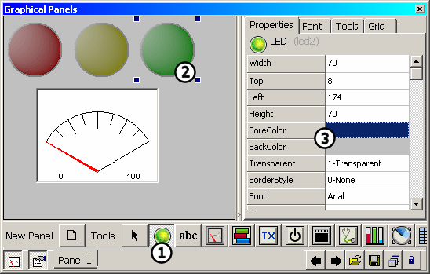
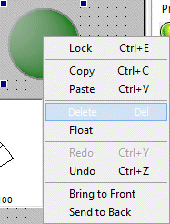

# Graphical Panels: Add or Delete a Tool

### Add a Tool

To add a tool to a graphical panel, start by selecting it from the toolbar near the bottom of the Graphical Panels view (Figure 1:). Then click anywhere on the panel to add the tool (Figure 1:).After adding the tool, you can freely move it by clicking and dragging. You can also resize the tool by clicking one of the four corner control handles and dragging it in the appropriate direction.

### Properties

On the right side of the view you will find a set of tabs, with the one labeled **Properties** shown by default (Figure 1:). Here you can view and change the properties of the currently-selected tool, or switch to other tabs to help you build and adjust your graphical panel. A full description of these tabs can be found in the discussion of Tool Properties.

### Right-Click Menu Commands

You can right-click to bring up a context menu with various options for working with the selected tool (Figure 2). For example, you can select the Delete entry from the menu to remove the current tool from the panel (the Delete key will also work for this). A full list of context menu options can be found in Table 1.

**Table 1: Graphical Panel Right-Click Menu Options**

| Option         | Description                                                                                                                         |
| -------------- | ----------------------------------------------------------------------------------------------------------------------------------- |
| Lock           | Switches between edit mode and run mode. When a panel is locked you can interact with its controls, but cannot move or change them. |
| Copy           | Saves a copy of the selected control to the Windows Clipboard.                                                                      |
| Paste          | Adds a copied control from the Windows Clipboard to the current panel.                                                              |
| Delete         | Removes a control from the panel.                                                                                                   |
| Float          | Causes the current panel to be shown in a **** floating window.                                                                     |
| Redo           | Reverses the last Undo operation, reapplying the action that was reversed.                                                          |
| Undo           | Undoes the last action taken on the panel.                                                                                          |
| Bring to Front | Positions the selected control above others on the panel.                                                                           |
| Send to Back   | Moves the selected control behind others on the panel.                                                                              |
