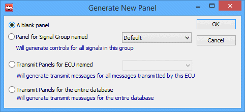
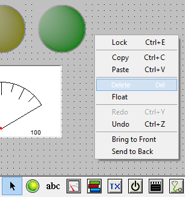

# Graphical Panels: Add or Delete Panels

When first launched, the Graphical Panels feature begins with a panel called **Panel 1**. One panel is sufficient for many applications, but for more complex tasks you can add additional panels and configure them however you wish. You can also delete panels that you decide you don't need.

### Add a Panel

Near the bottom left corner of the screen you will see the words **New Panel** and an icon of a blank document (Figure 1). Click the icon to bring up a dialog box with options for creating the new panel (Figure 2).

There are four options you can choose from here, some of which may be real time-savers:

* **Blank Panel:** A simple empty panel where you can add tools of your choice.
* **Panel for Signal Group:** Choose this option and then select a signal group; Vehicle Spy will automatically generate controls for each signal.
* **Transmit Panels for ECU:** Select an ECU and transmit message tools will be generated for each of its messages.
* **Transmit Panels for Database:** Generate transmit tools for the current database.

After making your selection and clicking **OK**, the panel will created, and a new panel tab for it will be shown next to the existing ones. You can easily work with your panels using these tabs. You can also adjust a panel's properties using the Panel Properties window.

### Delete a Panel

To remove a panel, right-click in a blank area of the panel and select **Delete**, as shown in Figure 3. Be sure you select the panel itself and not one of the tools, or that will be deleted instead. You can also right-click on the panel's tab and choose the same option.

Note that if you have only one panel, Vehicle Spy will not allow you to delete it.

