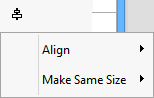
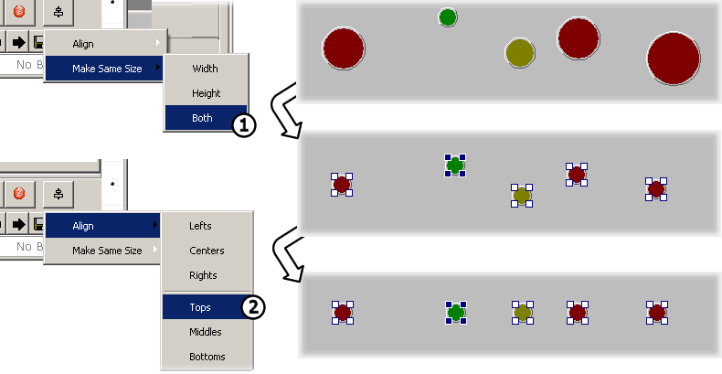

# Graphical Panels: Format (Align or Resize) a Tool Group

Formatting a group allows you to either set all the tools to the same size, or align them along a particular dimension. Start by selecting a set of tools either by dragging a selection box around them, or Ctrl+clicking the tools you want to work with. Each control will show a set of square handles on its corners to indicate that it has been selected.

Notice that the last tool selected will have black handles rather than white ones. This is the tool that will be used as the base for changes made in the group, as described below. You can Ctrl+click a tool within a group selection to change which gets the black handles and is thus the basis for the formatting operation.

After making a selection, click the **Format** button at the far right end of the controls toolbar near the bottom of the screen. This will cause a menu to appear with two options: **Align** and **Make Same Size** (Figure 1).

### Make Same Size

This option allows you to quickly equalize the dimensions of a set of tools. This is especially useful when working with tools of the same type, such as a group of LEDs.

To use this feature, hover over the **Make Same Size** menu item and then select **Width**, **Height** or **Both** from the submenu that appears (Figure 1:). The dimensions of the tools will change to match those of the tool with the black control handles.

### Align

This option allows you to align a group of controls so that they share a common edge or centerline, either horizontally or vertically.

Hover over the **Align** menu item and six options will appear. Choose **Lefts**, **Centers** or **Rights** to align objects vertically, or select from **Tops**, **Middles** or **Bottoms** for horizontal alignment. The tools with white handles will move to match the selected alignment axis of the tool with black handles. For example, selecting **Tops** will move all the white-handled tools so their **Top** property matches that of the black-handled tool (Figure 1:).

