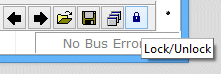

# Graphical Panels: Lock Panels

Upon first entering the Graphical Panels feature, you will be in _edit mode_, which allows you to create and modify panels and tools. When you are ready to test or use your design, it is a good idea to lock the panels.

Locking panels prevents them from being accidentally changed, and ensures that all tools function properly. In the case where one individual designs a graphical panel for another, it is also a good idea for the creator to lock the panels before distributing them.

To lock the panel, simply press the lock/unlock button located at the bottom right corner of the screen (Figure 1). You will immediately see that the bottom toolbar row and right-hand property boxes are hidden. To unlock the panels for editing, just hit the button again.

